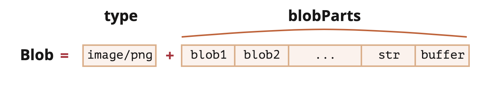

# Blob

> Объект с бинарными данными, и не обязательно указанным типом

💠 **new Blob`(blobParts, options?)`**

&emsp;&emsp; 🔹 `blobParts` - массив значений `Blob/Buffer/String`

&emsp;&emsp; 🔹 `options`  
&emsp;&emsp;&emsp;&emsp; 🎯 `type` - MIME-тип объекта, который будет прочитан сервером  
&emsp;&emsp;&emsp;&emsp; 🎯 `endings` - форматирование окончания строк создаваемого Blob "transparent" (ничего не делать), но также может быть "native" (изменять).
 
```javascript
let hello = new Uint8Array([72, 101, 108, 108, 111]); // 👉🏼 "hello" в бинарной форме,
    blob = new Blob([hello, ' ', 'world'], {type: 'text/plain'}); // 👉🏼 Объединяем бинарные данные и строки в целый Blob

blob.text().then(res => {
    console.log(res) // 👉🏼 Конвертируем бинарные данные Blob в текст, получаем 'Hello world'
})
```

<br>

## 🚩 Blob как URL

🎯 Blob это данные лежащие в определенной области памяти

🎯 К ним так же можно получить доступ по ссылке

🎯 Ссылку можно получить при помощи метода `URL.createObjectURL(blob)`

🎯 И поместить в любой тег отображающий содержимое   
&emsp;&emsp; 👆 например `<a>` или ``     

🔹 Ссылка актуальна пока не произошла перезагрузка странички

🛑 Сборщик мусора не сможет отчистить память занятую `Blob`, пока на него есть ссылка

&emsp;&emsp; 👆 Хорошей практикой являеться удаление ссылки сразу после получения    

```javascript
let link = document.createElement('a');
link.download = 'hello.txt';

let blob = new Blob(['Hello, world!'], {type: 'text/plain'});

link.href = URL.createObjectURL(blob);

link.click();

URL.revokeObjectURL(link.href);
```

<br>

## 🚩 Blob в base64

👆 `base64` это формат, преобразующий бинарные данные в строку, которую могут воспринимать `html` теги

```javascript
let link = document.createElement('a');
link.download = 'hello.txt';

let blob = new Blob(['Hello, world!'], {type: 'text/plain'});

let reader = new FileReader();
reader.readAsDataURL(blob); // конвертирует Blob в base64 и вызывает onload

reader.onload = function() {
  const base64Data = reader.result // data:text/plain;base64,SGVsbG8sIHdvcmxkIQ==   
  link.href = base64Data;
};
```

## 🚩 Изображение в Blob

🎯 Любую часть сайта можно нанести на холст, и преобразовать в `blob`

🎯 Это позволяет делать скриншоты из браузера, и отправлять их на сервере

```javascript
// 👉🏼 Берём любое изображение
let img = document.querySelector('img');

// 👉🏼 Создаём <canvas> того же размера
let canvas = document.createElement('canvas');
canvas.width = img.clientWidth;
canvas.height = img.clientHeight;

let context = canvas.getContext('2d');

// 👉🏼 Копируем изображение в  canvas (метод позволяет вырезать часть изображения)
context.drawImage(img, 0, 0);
// 👉🏼 Мы можем вращать изображение при помощи context.rotate() и делать множество других преобразований

// 👉🏼 toBlob является асинхронной операцией, для которой callback-функция вызывается при завершении
canvas.toBlob(function(blob) {
  // 👉🏼 После того, как Blob создан, загружаем его
  let link = document.createElement('a');
  link.download = 'example.png';

  link.href = URL.createObjectURL(blob);
  link.click();

  // 👉🏼 Удаляем внутреннюю ссылку на Blob, что позволит браузеру очистить память
  URL.revokeObjectURL(link.href);
}, 'image/png');
```
⚡ `async/await` вариант работы с `toBlob`
```javascript
let blob = await new Promise(resolve => canvasElem.toBlob(resolve, 'image/png'));
```

<br>

## 🚩 Из Blob в ArrayBuffer

👆 `Blob` можно преобразовать в `ArrayBuffer`, для более низкоуровневых операция

```javascript
let blob = new Blob(["<html>…</html>"], {type: 'text/html'}),
    fileReader = new FileReader();

    // получаем arrayBuffer из Blob
    fileReader.readAsArrayBuffer(blob);

fileReader.onload = function(event) {
    let arrayBuffer = fileReader.result;
    
    console.log(arrayBuffer)
};
```
⚡️ Без `FileReader`
```javascript
let blob = new Blob(["<html>…</html>"], {type: 'text/html'});

blob.arrayBuffer().then(buffer => console.log(buffer))
```

<br>

## 🚩 Blob Срез

🎯 `Blob` как и строку нельзя изменить, но можно создать новую взяв нужную часть от оригинала

🎯 Срез, позволяет резать `Blob` по кусочками, передавать, и собирать в единый файл в конечной точке  

```javascript
function sliceFile(file, chunksAmount) {
  var byteIndex = 0;
  var chunks = [];
    
  for (var i = 0; i < chunksAmount; i += 1) {
    var byteEnd = Math.ceil((file.size / chunksAmount) * (i + 1));
    chunks.push(file.slice(byteIndex, byteEnd));
    byteIndex += (byteEnd - byteIndex);
  }

  return chunks;
}
```

<br>

### ⟵ **<a href="../../readme.md">Назад</a>**