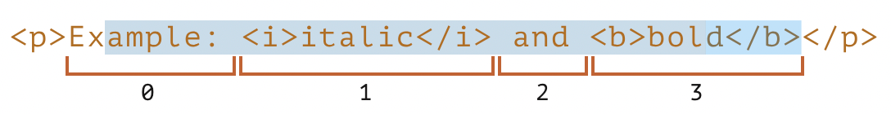

# Выделение текста
> Выделить текст на страничке можно тремя способами

🔹 При помощи `Range()`    
&emsp;&emsp; 👆 Обьект описывающий параметры выделения, который в следствии нужно передать в   
`document.getSelection().addRange(range);`  

<br>

🔹 При помощи `document.getSelection()`    
&emsp;&emsp; 👆 Метод возвращающий обьект `Selection`, у которого есть свой набор методов для выделения текста на страничке  

<br>

🔹 При помощи специального `API`, работающего только в элементах формы  

<br>

## Range
  
<br>

💠 Указать точку начала выделения  
👆🏽 Включая ноду, и `offset`   


&emsp;&emsp; 🔹 `setStart(node, offset)`  
&emsp;&emsp;&emsp;&emsp; 👆 Начать выделение:  
&emsp;&emsp;&emsp;&emsp;&emsp;&emsp; 🎯 На указанной ноде, включаяя ее  
&emsp;&emsp;&emsp;&emsp;&emsp;&emsp; 🎯 На указанной ноде, начиная с offset, включаяя символ или элемент лежащий на указанном offset

&emsp;&emsp; 🔹 `setStartBefore(node)`

&emsp;&emsp; 🔹 `setStartAfter(node)`

<br>

💠 Указать точку окончания выделения   

&emsp;&emsp; 🔹 `setEnd(node, offset)`  
&emsp;&emsp;&emsp;&emsp; 👆 Закончить выделение:  
&emsp;&emsp;&emsp;&emsp;&emsp;&emsp; 🎯 До указанной ноды   
&emsp;&emsp;&emsp;&emsp;&emsp;&emsp; 🎯 До указанной ноды, взяв в выделение то что лежит до offset,  

&emsp;&emsp; 🔹 `setEndBefore(node)`  
&emsp;&emsp;&emsp;&emsp; 👆 Закончить выделение, до указанной ноды, не включаяя ее

&emsp;&emsp; 🔹 `setEndAfter(node)`  
&emsp;&emsp;&emsp;&emsp; 👆 Закончить выделение, после указанной ноды, включая указанную ноду

<br>

💠 Offset  
👆🏽 Смещение точки выделения, относительно выбранной `node`   



&emsp;&emsp; 🔹 `offset` для текстовой ноды  
&emsp;&emsp;&emsp;&emsp; 👆 Проходит по символьно    
```javascript
range.setStart(p.firstChild, 2);
```

<br>

&emsp;&emsp; 🔹 `offset` для `html` ноды  
&emsp;&emsp;&emsp;&emsp; 👆 Проходит по дочерним нодам
```javascript
range.setEnd(p, 4);
```

<br>

## Selection

<br>

## Form API

<br>

### ⟵ **<a href="../../readme.md">Назад</a>**