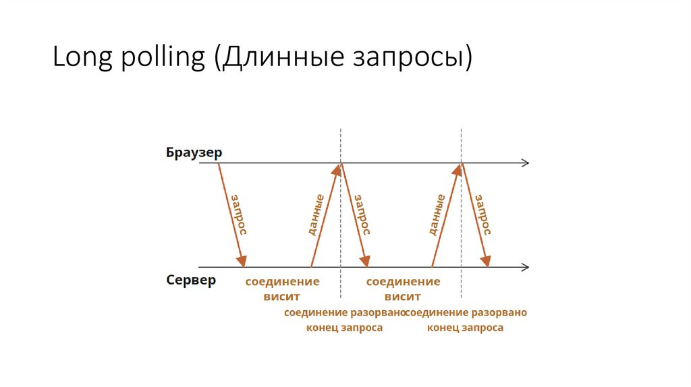

# long-polling

👆🏽 Техника получения новых данных с сервера, путем создания безконечного потока длительных запросов

<details>
<summary> 💠 Алгоритм работы </summary>


🎯 Клиент отправляет запрос на сервер

<details>
<summary> 🥏 На сервере стоит бесконечный цикл (PHP)</summary>


&emsp;&emsp; 🎯 Цикл раз в `n` секунд, делает запрос в базу, для пересчета колличества нужных данных

&emsp;&emsp; 🎯 Если через `n` секунд, данные никак не изменились, запрос ничего не вернет, и отвалиться по таймауту  
&emsp;&emsp;&emsp;&emsp; 👆 Длительность соединения `long polling` запроса, можно настраивать на сервере


</details>

<details>
<summary> 🥏 На сервере стоит слушатель событий</summary>


&emsp;&emsp; 🎯 Сервер вернет новые данные только после того как сработает слушатель обновления данных  

&emsp;&emsp; 🎯 Если через данные не изменяться, слушатель не сработает, и запрос отвалиться по таймауту


</details>    
    

🎯 После ошибки по таймуту, в `catch` колбеке длинный запрос создаеться еще раз  
🎯 Если данные на сервере обновились, метод бекенда вернет обновленные данные  
🎯 После получение новых данных создается новый длинный запрос для получения новых данных   
🎯 Этот цикл можно держать до тех пор, пока есть необходимость получать новые данные с сервера  


</details>

<details>
<summary>&emsp; Клиент</summary>


```typescript jsx
function App() {
    const [messages, setMessages] = useState([]);
    const [value, setValue] = useState('');


    // 👉🏼 Подписка на обновление при ините странички
    useEffect(() => {
        subscribe()
    }, [])

    // 👉🏼 Шлет long-polling запросы  
    const subscribe = async () => {
        try {
            const {data} = await axios.get(`${API_URL}/get-messages`)
            setMessages(prev => [data, ...prev])
            await subscribe()
        } catch (e) {
            setTimeout(() => {
                subscribe()
            }, 500)
        }
    }

    // 👉🏼 Шлет новые сообщения
    const sendMessage = async () => {
        await axios.post(`${API_URL}/new-messages`, {
            message: value,
            id: Date.now()
        })
    }

  return (
      <div className="center">
          <div>
              <div className="form">
                  <input value={value} onChange={e => setValue(e.target.value)} type="text"/>
                  <button onClick={sendMessage}>Отправить</button>
              </div>
              <div className="messages">
                  {messages.map(mess =>
                      <div className="message" key={mess.id}>
                          {mess.message}
                      </div>
                  )}
              </div>
          </div>
      </div>
  )
}

```


</details>

<details>
<summary>&emsp; Сервер</summary>


```typescript
const express = require('express');
const cors = require('cors');
const events = require('events')
const PORT = 5080;

const emitter = new events.EventEmitter();

const app = express()

app.use(cors())
app.use(express.json())

app.get('/get-messages', (req, res) => {
    emitter.once('newMessage', (message) => {
        res.json(message)
    })
})

app.post('/new-messages', ((req, res) => {
    const message = req.body;
    emitter.emit('newMessage', message)
    res.status(200)
}))


app.listen(PORT, () => console.log(`server started on port ${PORT}`))
```


</details>

[](https://codesandbox.io/p/github/webster-doc/long-polling-demo/master?layout=%257B%2522sidebarPanel%2522%253A%2522EXPLORER%2522%252C%2522rootPanelGroup%2522%253A%257B%2522direction%2522%253A%2522horizontal%2522%252C%2522contentType%2522%253A%2522UNKNOWN%2522%252C%2522type%2522%253A%2522PANEL_GROUP%2522%252C%2522id%2522%253A%2522ROOT_LAYOUT%2522%252C%2522panels%2522%253A%255B%257B%2522type%2522%253A%2522PANEL_GROUP%2522%252C%2522contentType%2522%253A%2522UNKNOWN%2522%252C%2522direction%2522%253A%2522vertical%2522%252C%2522id%2522%253A%2522clomyrji800073b6i77rqrfhq%2522%252C%2522sizes%2522%253A%255B70%252C30%255D%252C%2522panels%2522%253A%255B%257B%2522type%2522%253A%2522PANEL_GROUP%2522%252C%2522contentType%2522%253A%2522EDITOR%2522%252C%2522direction%2522%253A%2522horizontal%2522%252C%2522id%2522%253A%2522EDITOR%2522%252C%2522panels%2522%253A%255B%257B%2522type%2522%253A%2522PANEL%2522%252C%2522contentType%2522%253A%2522EDITOR%2522%252C%2522id%2522%253A%2522clomyrji800033b6i0tnz6415%2522%257D%255D%252C%2522sizes%2522%253A%255B100%255D%257D%252C%257B%2522type%2522%253A%2522PANEL_GROUP%2522%252C%2522contentType%2522%253A%2522SHELLS%2522%252C%2522direction%2522%253A%2522horizontal%2522%252C%2522id%2522%253A%2522SHELLS%2522%252C%2522panels%2522%253A%255B%257B%2522type%2522%253A%2522PANEL%2522%252C%2522contentType%2522%253A%2522SHELLS%2522%252C%2522id%2522%253A%2522clomyrji800053b6i6mh3imhw%2522%257D%255D%252C%2522sizes%2522%253A%255B100%255D%257D%255D%257D%252C%257B%2522type%2522%253A%2522PANEL_GROUP%2522%252C%2522contentType%2522%253A%2522DEVTOOLS%2522%252C%2522direction%2522%253A%2522vertical%2522%252C%2522id%2522%253A%2522DEVTOOLS%2522%252C%2522panels%2522%253A%255B%257B%2522type%2522%253A%2522PANEL%2522%252C%2522contentType%2522%253A%2522DEVTOOLS%2522%252C%2522id%2522%253A%2522clomyrji800063b6i3e475jei%2522%257D%255D%252C%2522sizes%2522%253A%255B100%255D%257D%255D%252C%2522sizes%2522%253A%255B40%252C60%255D%257D%252C%2522tabbedPanels%2522%253A%257B%2522clomyrji800033b6i0tnz6415%2522%253A%257B%2522id%2522%253A%2522clomyrji800033b6i0tnz6415%2522%252C%2522tabs%2522%253A%255B%255D%257D%252C%2522clomyrji800063b6i3e475jei%2522%253A%257B%2522id%2522%253A%2522clomyrji800063b6i3e475jei%2522%252C%2522activeTabId%2522%253A%2522clomyvggj00t63b6ir3lk66j6%2522%252C%2522tabs%2522%253A%255B%257B%2522type%2522%253A%2522UNASSIGNED_PORT%2522%252C%2522port%2522%253A5080%252C%2522id%2522%253A%2522clomysyvt00ft3b6imrbniat1%2522%252C%2522mode%2522%253A%2522permanent%2522%252C%2522path%2522%253A%2522%2522%257D%252C%257B%2522type%2522%253A%2522UNASSIGNED_PORT%2522%252C%2522port%2522%253A3000%252C%2522id%2522%253A%2522clomyvggj00t63b6ir3lk66j6%2522%252C%2522mode%2522%253A%2522permanent%2522%252C%2522path%2522%253A%2522%252F%2522%257D%255D%257D%252C%2522clomyrji800053b6i6mh3imhw%2522%253A%257B%2522id%2522%253A%2522clomyrji800053b6i6mh3imhw%2522%252C%2522activeTabId%2522%253A%2522clomyt4na00hf3b6i8ubbhtot%2522%252C%2522tabs%2522%253A%255B%257B%2522id%2522%253A%2522clomyrji800043b6im435tnsg%2522%252C%2522mode%2522%253A%2522permanent%2522%252C%2522type%2522%253A%2522TERMINAL%2522%252C%2522shellId%2522%253A%2522clomyrjqa000heehuhq96bcnu%2522%257D%252C%257B%2522id%2522%253A%2522clomyt4na00hf3b6i8ubbhtot%2522%252C%2522mode%2522%253A%2522permanent%2522%252C%2522type%2522%253A%2522TERMINAL%2522%252C%2522shellId%2522%253A%2522clomyt4s5000jeehu3x4a82io%2522%257D%255D%257D%257D%252C%2522showDevtools%2522%253Atrue%252C%2522showShells%2522%253Atrue%252C%2522showSidebar%2522%253Atrue%252C%2522sidebarPanelSize%2522%253A15%257D)


<br>

### ⟵ **<a href="../../readme.md">Назад</a>**