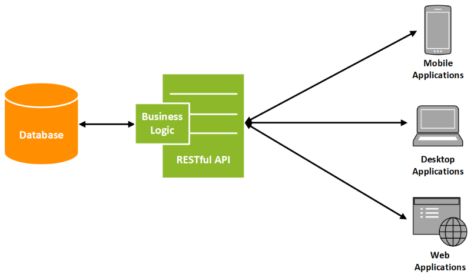

# REST FULL API

👆🏽 Это сервер, который получает и отдает данные следуя правилам `rest`

 💠 Правила REST

🎯 Делить элементы бизнес логики на отдельные сущности      

🎯 Выделять на работу с каждой сущностью `URL` с необходимым методом `GET/POST`  

🎯 Соблюдать валидность методов и кодов    

 

 💠 Методы 

 🔹 GET  
&emsp;&emsp; 👆 Получение данных

 🔹 POST  
&emsp;&emsp; 👆 Создание данных

 🔹 PUT  
&emsp;&emsp; 👆 Изменет сущность полностью на то что передали в запросе

 🔹 PATCH  
&emsp;&emsp; 👆 Изменет только те поля что передали, остальное останеться неизменным

 🔹 DELETE  
&emsp;&emsp; 👆 Удалит

 

 💠 Коды 

 🔹 `1XX`  
&emsp;&emsp; 👆 Информационные

 🔹 `2XX`  
&emsp;&emsp; 👆 Успешно выполненные

 🔹 `3XX`  
&emsp;&emsp; 👆 Редиректы

 🔹 `4XX`  
&emsp;&emsp; 👆 Ошибка клиента

 🔹 `5XX`  
&emsp;&emsp; 👆 Ошибка сервера

 

### ⟵ **<a href="../../readme.md">Назад</a>**
    