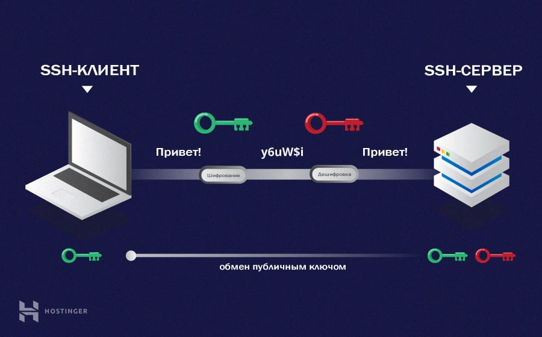

# SSH

👆🏽 Сетевой протокол, позволяющий безопасно передавать важные данные с локального компьютера на рабочий сервер, используя даже не безопасное `wifi` соединение   

🔹 Все передаваемые данные шифруються двумя ключами    
&emsp;&emsp; 🎯 `Публичные`:`id_rsa.pub`    
&emsp;&emsp;&emsp;&emsp; 👆 Храниться на удаленном сервере   

&emsp;&emsp; 🎯 `Приватный`:`id_rsa`  
&emsp;&emsp;&emsp;&emsp; 👆 Храниться локально  

 Алгоритм шифрования данных

🎯 Начинаеться с `ассиметричного` шифрования  
🎯 Браузер отправляет серверу запрос на `ssh` соединение        
🎯 Если это возможно, сервер отправляет публичный ключ  
&emsp;&emsp; 👆 Которым клиент будет шифроват все отправляемые данные

🎯 Получив публичный ключ, клиент генерирует ключ `ssh` сессии  
&emsp;&emsp; 👆 Который можно расшифровать только приватным ключем, который лежит на сервере

🎯 После генерации сессионного ключа, устанавливаеться `симетричное шифрование`    
&emsp;&emsp; 👆 Более дешевый вид шифрования, когда на двух концах используеться один и тот же ключ, для шифрования и расшифровки

 

### ⟵ **<a href="../../readme.md">Назад</a>**