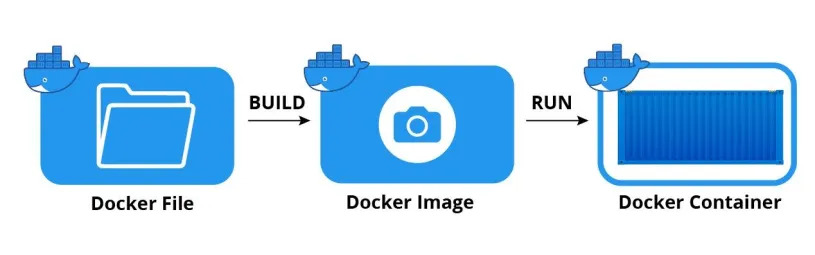

# Docker
👆🏽 Демон, который запускает и связывет между собой изолированные контейнеры  

🔹 `Контейнер`  
&emsp;&emsp; 👆 Запущенный изолированный экземпляр образа 

 

🔹 `Образ`  
&emsp;&emsp; 👆 Набор правил определяющий:  
&emsp;&emsp;&emsp;&emsp; 🎯 Версии библиотек  
&emsp;&emsp;&emsp;&emsp; 🎯 Структуру папок  
&emsp;&emsp;&emsp;&emsp; 🎯 Порядок запуска команд  
&emsp;&emsp;&emsp;&emsp; 🎯 Глобальные переменные и порты

 

🔹 `Цикл работы`  
&emsp;&emsp; 🎯 Разработчик пишет конфиг образа с правилами и версиями библиотек  
&emsp;&emsp; 🎯 Собирает из файла образ     
&emsp;&emsp; 🎯 Запускает образы, добавив их в изолированный контейнер   
&emsp;&emsp; 🎯 Синхронизирует изолированные контейнеры в нужных местах соприкосновения

* **<a href="./pages/image/readme.md">Image</a>**
* **<a href="./pages/container/readme.md">Container</a>**
* **<a href="./pages/volume/readme.md">Volume</a>**  
* **<a href="./pages/makefile/readme.md">Makefile</a>**
* **<a href="./pages/docker-compose/readme.md">Docker compose</a>**

[comment]: <> (💠 **Deploy на докерхаб**)

[comment]: <> (use custom npm)

[comment]: <> (https://medium.com/@Quigley_Ja/specifying-npm-version-in-dockerfile-ee6e71a60945)

[comment]: <> (https://makefiletutorial.com/#automatic-variables - about @ before command)

[comment]: <> (https://www.youtube.com/watch?v=Sm8GbC02MlE&ab_channel=AhsanNasir - react docker nginx)

[comment]: <> (https://www.youtube.com/watch?v=SF2oub6C6kc&ab_channel=PrettyCode - докер сетки)

[comment]: <> (https://www.youtube.com/watch?v=3xDAU5cvi5E&ab_channel=SanjeevThiyagarajan - докер реакт)