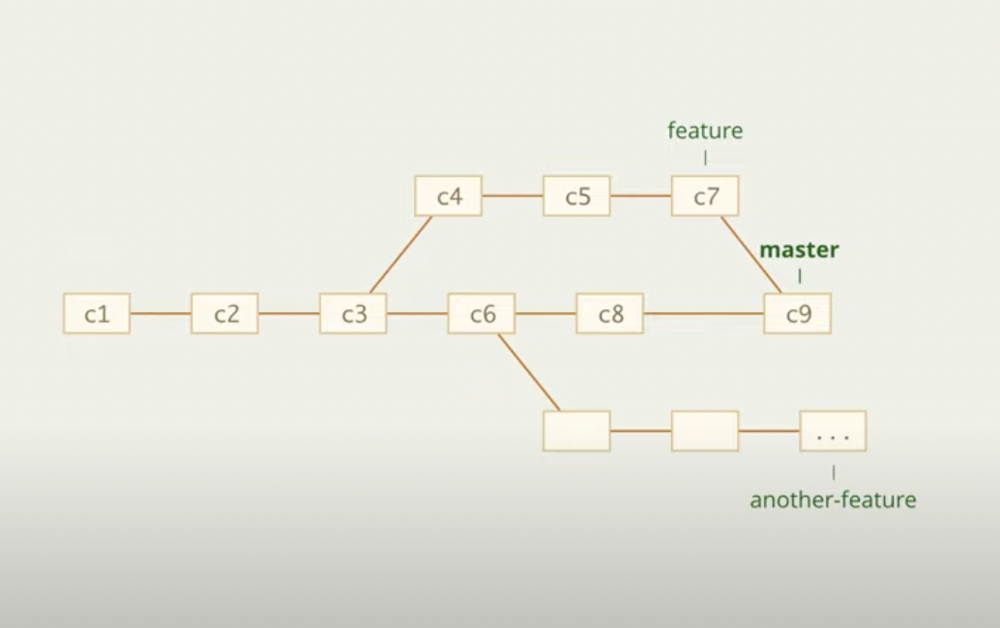
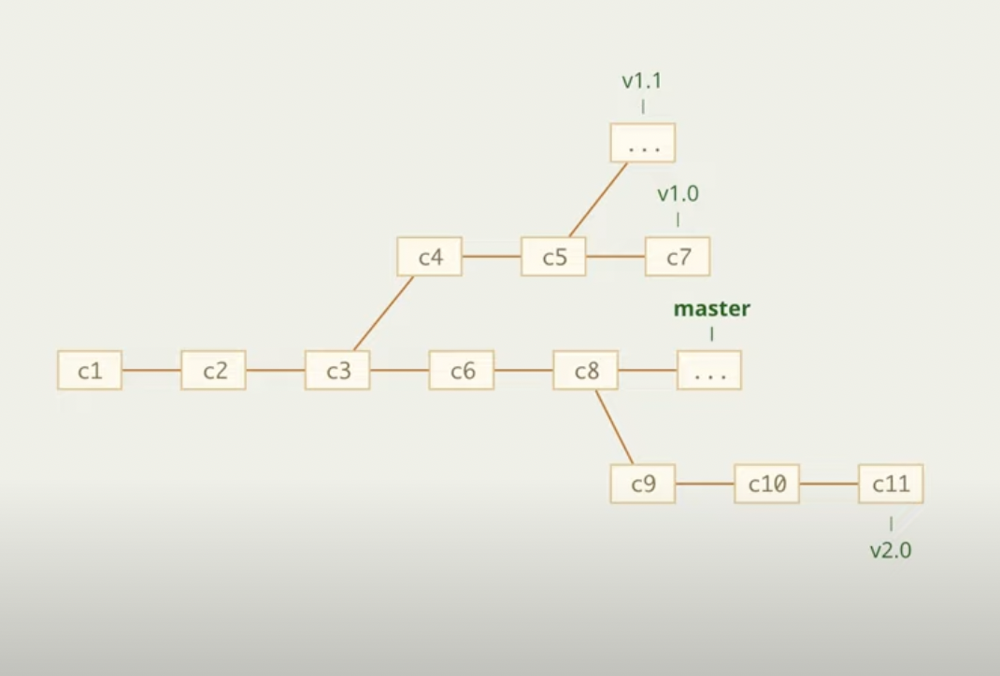
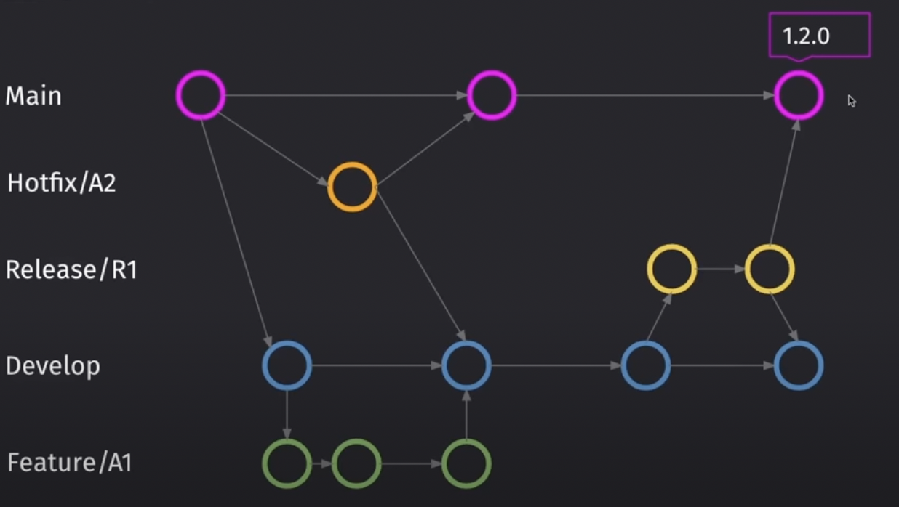

# Методология ведения истории веток

  

 🔹 Тематические 

👆 Ведет продакшен версию в `master`, постепенно вливая новый функционал из тематических веток  

 

 🔹 Релизные 

👆 Хранит в репозитории несколько версия проекта  
&emsp;&emsp; ❗ Используеться чаще для библиотек

 🔹 Разработка всех фичь ведеться в master

----

👆 Как только код проекта заканчивает пул каких-то наработок, эту версию отделяют в отдельную релизную ветку и дорабатывают отдельно от `master`

----

 🔹 В релизную ветку не льются доработки из master

----

👆 Любые новые наработки которые нужны в продакшене заводят как новую релизную ветку, на котороую можно переключиться

----

 
 

 🔹 Git Flow 

👆 Методика обьединяющая в себе `релизный` и `тематический` подход  

 🔹 Main

----

Продакшен ветка

----

 

 🔹 Develop

----

Хранит в себе набор всех фич и багфиксов перед релизом

----

 

 🔹 Release 1.2.0

----

Фиксирует в себе список наработок релиза, позволяя отдельно тестировать пул наработок, и не блокировать новый поток фич в `develop`

&emsp;&emsp; 🎯 В Релиз ветку можно лить фикс ветки    

&emsp;&emsp; 🛑 После правки всех фиксов, релиз ветку как в `master`, так и в `dev`  
&emsp;&emsp;&emsp;&emsp; 👆 Что бы получить фиксы из релиза в разработке 

----

 

 🔹 Hotfix

----

Ветки для быстрого исправления продашкеша, минуя весь флоу

&emsp;&emsp; 🛑 Так же льються в `dev`   
&emsp;&emsp;&emsp;&emsp; 👆 Что бы не потерять фиксы при след релизах

----

 

### ⟵ **<a href="../../readme.md">Назад</a>**