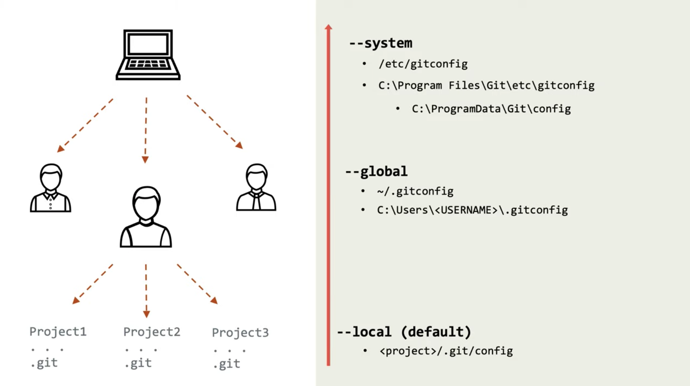

# Config
> Файл конфигурации, из которого `git` берет дополнительную информацию для комита:

🎯 Игнорируемые файлы для проекта

🎯 Имя автора коммита

🎯 Емаил автора комита

🎯 Алиасы

🎯 Редактор в гите

<br>

<p align="center" style="text-align:center">
      
</p>

💠 **Виды конфиг файлов**  

&emsp;&emsp; 🔹 `--local`  
&emsp;&emsp;&emsp;&emsp; 👆 Конфиг файлы на уровне проекта

&emsp;&emsp;&emsp;&emsp;&emsp;&emsp; 🎯 В первую очередь данные беруться из `config --local`

&emsp;&emsp;&emsp;&emsp;&emsp;&emsp; 🎯 Храняться по пути `<project>/.git/config`

<br>

&emsp;&emsp; 🔹 `--global`  
&emsp;&emsp;&emsp;&emsp; 👆 Конфиг файлы на уровне одного пользователя PC

&emsp;&emsp;&emsp;&emsp;&emsp;&emsp; 🎯 Если нужных данных нет в `local`, гит ищет их в `global`

&emsp;&emsp;&emsp;&emsp;&emsp;&emsp; 🎯 Храняться по пути `~/.gitconfig`

&emsp;&emsp;&emsp;&emsp;&emsp;&emsp; 🎯 Обычно содержит в себе общие настройки для всех проектов(username, gitignore)

<br>

&emsp;&emsp; 🔹 `--system`  
&emsp;&emsp;&emsp;&emsp; 👆 Конфиг файлы на уровне системы для всех пользователей PC

&emsp;&emsp;&emsp;&emsp;&emsp;&emsp; 🎯 Если нужных данных нет в `global`, гит ищет их в `system`

&emsp;&emsp;&emsp;&emsp;&emsp;&emsp; 🎯 Храняться по пути `etc/gitconfig`

<br>

🛑 `.gitingore` проекта включает в себя данные из каждого `.gitingore` (`local`, `global`, `system`)

<br>
<br>

💠 **Структура `config` файла**  
```
[user]
	email = webster6667g@gmail.com
	name = Alex Mirgorodsky
[core]
	autocrlf = input
	excludesFile = /Users/www1/.gitignore
	editor = nano
[alias]
    co = checkout
    ci = commit
    st = status
```

<br>
<br>

💠 **Команды для работы с конфигом**  

&emsp;&emsp; 🔹 Просмотреть конфиг

&emsp;&emsp;&emsp;&emsp; 🎯 `git config --list` - Все уровни конфигов

&emsp;&emsp;&emsp;&emsp; 🎯 `git config --list --global` - Только глобальный конфиг

<br>

&emsp;&emsp; 🔹 Изменить конфиг  
&emsp;&emsp;&emsp;&emsp; 👆 Проще перейти в конкретный файл, и изменить его структуру

<br>
<br>

💠 **Алиасы**   
&emsp;&emsp;&emsp;&emsp; 👆 Хот кеи гит команд, храняться в конфигах 

&emsp;&emsp; 🎯  Добавить алиас `git st` в глобал конфиг, выполняющий команду между кавычек 
```
git config --global alias.st 'status'
```

<br>

&emsp;&emsp; 🎯 Все флаги прописанные после алиаса, примениться к команде алиаса `status`
```
git st --short
```

<br>

&emsp;&emsp; 🎯 Для объединения нескольких команд в один алиас, указать восклицательный `!` знак в начале алиаса, разделив команды `;`
```
git config --global alias.cia '!git add .;git commit'
```

<br>

⟵ **<a href="../../readme.md">Назад</a>**