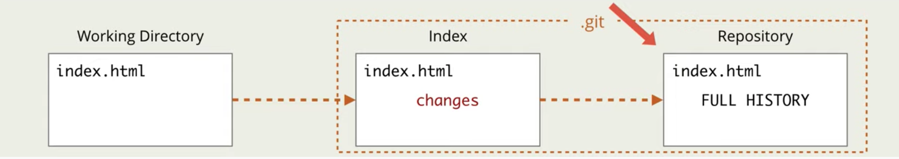

      

# Цикл добавления коммита
> Прежде чем попасть в репозиторий, файлы проходят цикл действий

🎯 `untracked`     
&emsp;&emsp; 👆 Файл добавление в папку проекта, но еще не отслеживаеться гитом

🎯 `Working Directory`     
&emsp;&emsp; 👆 Файл проиндексирован, но еще не в репозитории и не готов к комиту

🎯 Добавление в индекс(`stage area`)  
&emsp;&emsp; 👆 Файл проиндексирован, добавлен в очередь на комит

🎯 `Comited`  
&emsp;&emsp; 👆 Файл проиндексирован, лежит в репозитории, его изменения отслеживаеться гитом

 

⟵ **<a href="../../readme.md">Назад</a>**