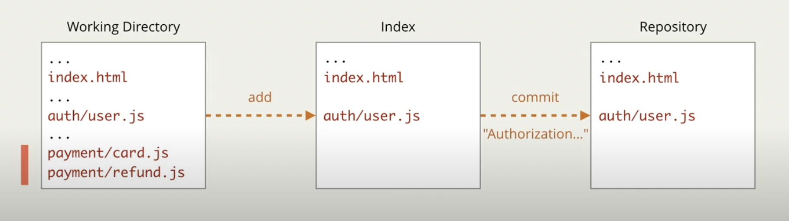
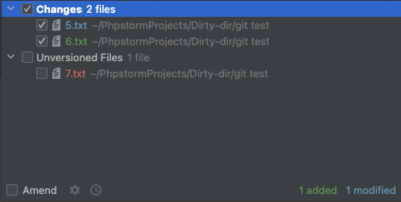

# Индекс 
👆🏽 Промежуточное звенно, куда скидывают все изменения, которые хотят закомитить  



📗 Его еще называют `staging area`, готовые к комиту `файлы на стейдже` 


<br>

💠 **Добавления в индекс**

&emsp;&emsp; ❗ В индекс нельзя добавить пустую папку  
&emsp;&emsp;&emsp;&emsp; 👆 Разработчики приняли соглашение, для добавоения пустой папки, ложить в нее пустой файл `.gitkeep`

<br>

&emsp;&emsp; 🔹 Индексированые файлы бывают двух видов

&emsp;&emsp;&emsp;&emsp; 🎯 `new-file`   
&emsp;&emsp;&emsp;&emsp;&emsp;&emsp; 👆 Файл который только что перешел из `untracked` в индекс

&emsp;&emsp;&emsp;&emsp; 🎯 `modified`  
&emsp;&emsp;&emsp;&emsp;&emsp;&emsp; 👆 Файл уже лежал в индексе, отслеживался гитом, в нем произвели изменения, и добавили в индекс для коммита 

&emsp;&emsp; 🛑 `IDE` часто исключают `index` состояние, запихивая все просто в `changes` состояние, позволяя самостоятельно прочекать оттуда файлы которые пойдут в `index` и срвзу в коммит    



<br>

&emsp;&emsp; 🔹 Добавление файлов по указанному пути
```
git add src/index.html
``` 

<br>

&emsp;&emsp; 🔹 Добавление всех файлов лежащих внутри текущей дирректории(в которой выполнена команда)
```
git add .
```

<br>

&emsp;&emsp; 🔹 Добавление вообще всех файлов проекта  
```
git add -A
```

<br>

&emsp;&emsp; 🔹 Добавление в индекс не весь файл, а определенные его изменения  
&emsp;&emsp;&emsp;&emsp; 👆 Например когда нужно закомитить одну функцию файла, не затрагивая осталные изменения

&emsp;&emsp;&emsp;&emsp; 👆 Пройдет по всем изменениям одного файла всех файлов, спрашивая через `[y, n]`, добавлять ли изменения в индекс 
```
git add . -p
git add my-file.html -p
```

<br>
<br>

💠 **Удаление из индекса**
> Не удаляет файл, а просто извлекает его из очереди на коммит

&emsp;&emsp; 🔹 Если файл был удален, нужно внести в индекс факт удаления файла
```
rm my-file.html 
git add my-file.html
```

<br>

&emsp;&emsp; 🔹 При попытке удалить файл изменения которого были не закомичены, git выдаст предупреждение

&emsp;&emsp;&emsp;&emsp; 👆 Так как при удалении незакомиченных изменений, вернуть их с помощью гита невозможно

&emsp;&emsp;&emsp;&emsp; ❗ Для игнорирования предупреждения нужно добавить флаг `-f` после команды `git rm -f`

<br>

&emsp;&emsp; 🔹 Команды удаления из индекса

&emsp;&emsp;&emsp;&emsp; 🎯 `git rm <filename>`

&emsp;&emsp;&emsp;&emsp;&emsp;&emsp; 🥏 Флаг `--cached`, удалит файл из гита но оставит локально

&emsp;&emsp;&emsp;&emsp;&emsp;&emsp; 🥏 Флаг `--f`, удалит файл полностью

&emsp;&emsp;&emsp;&emsp; 🎯 `git reset` <a href="./pages/reset/readme.md">описанно отдельно</a>

&emsp;&emsp;&emsp;&emsp; 🎯 `git checkout` <a href="./pages/checkout/readme.md">описанно отдельно</a>

<br>

⟵ **<a href="../../readme.md">Назад</a>**