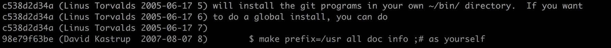

# Поиск автора строки в файле

```shell
git blame index.html --date=short
```



🎯 `-L1,5`    
&emsp;&emsp; 👆 Вывести авторов с 1-й по 5-ю строку

<br>

### ⟵ **<a href="../../readme.md">Назад</a>**