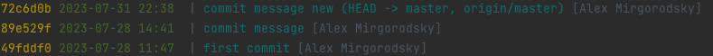

# Pretty
👆🏽 Стили вывода git log 

<br>

<details>
<summary> 🔹 Сокращенный вывод в одну строку</summary>


```shell
git log --oneline
```




</details>

<details>
<summary> 🔹 Кастомизированный и более информативный вывод в одну строку</summary>


```shell
git log --pretty=format:'%C(Yellow)%h %C(dim green)%ad %C(white) | %C(cyan)%s%d %C(#667788)[%an]' --date=format:'%F %R'
```


<br>

📗 Для получения подробностей о форматировании выполняем команду 
```shell
git help log
```


⚡️ Для того что бы сократить огромные команды, можно записать их в конфиг под определенным именем  
```shell
git config --global pretty.primary format:'%C(Yellow)%h %C(dim green)%ad %C(white) | %C(cyan)%s%d %C(#667788)[%an]' # Создать экземпляр форматирование вывода
git config --global format.pretty primary # Выбрать экземпляр вывода по умолчанию
git config --global log.date format:'%F %R' # Форматирование вывода [ short | medium |relative| format ]
```
</details>


<br>

### ⟵ **<a href="../../readme.md">Назад</a>**