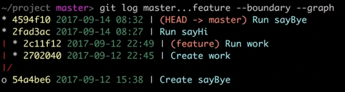

# Диапозоны поиска логов

🔹 Получить логи векти `feature`, с тех пор как она отошла от ветки `master`  
```shell
git log master..feature
```
  

&emsp;&emsp; 🎯 `--boundary` Включить в список коммит после которого ветки разошлись в разные стороны   
  
<br>  

🔹 Сравнить две ветки, с момента расхождение коммитов

```shell
git log master...feature --boundary --graph
```



<br>

### ⟵ **<a href="../../readme.md">Назад</a>**