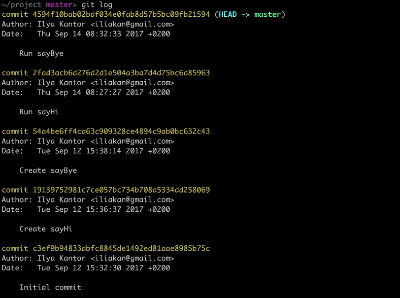

# git log
> Команда для отслеживания действий по истории комитов 

<br>

```shell
git log
```



🎯 `-p`  
&emsp;&emsp; 👆 Отобразить изменения в файлах   
  
  
<br>

```shell
git reflog
```
👆 Более глубокий режим `git log`, в котором доступны не достижимые коммиты, и все операции с ветками 

&emsp;&emsp; 🎯 Обычный коммит живет в рефлоге `90` дней        
&emsp;&emsp; 🎯 Недостежимиый коммит живет в рефлоге `30` дней  
&emsp;&emsp; 🛑 Реф лог живет только локально

<br>

* <a href="./pages/pretty/readme.md">Формат выводв логов</a>
* <a href="./pages/range/readme.md">Диапазоны логов</a>
* <a href="./pages/fillter/readme.md">Фильтры логов</a>
* <a href="./pages/author/readme.md">Поиск автора комита</a>

### ⟵ **<a href="../../readme.md">Назад</a>**