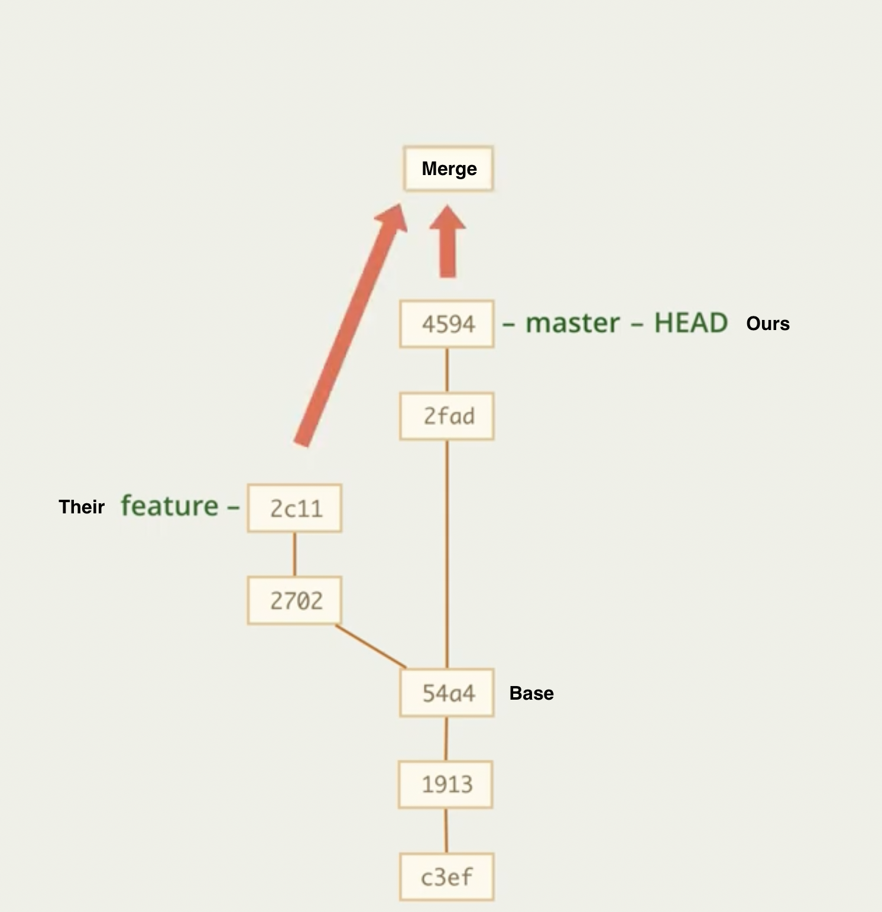

# Merge
👆🏽 Слияние двух веток  

<br>

  
<details>
<summary> 🔹 Перемотка </summary>


https://github.com/webster6667/documentation/assets/83826752/5bde9959-9cf3-44d4-b048-25e879e355d4    
👆 Смена вершины ветки `master`, на коммит вершины ветки `fix`  
&emsp;&emsp; ❗ Произойдет только в том случаи, если вершиной ветки `master` будет тот коммит, от которого был создан `fix`


</details>

  
<br>

   

<details>
<summary> 🔹 Истинное слияние </summary>



```shell
git merge feature
```
👆 Создание нового комита, в котором обьеденены комиты из двух веток


</details>

<br>

<details>
<summary> 🔹 Прерванное слияние ( конфликт ) </summary>


👆 Состояние когда на ветках в одном и том же месте кода, были выполненны разные изменения, и при попытки слияния образовался конфликт

&emsp;&emsp; 🎯 Проект переходит в состояние `прерванного коммита`, требуя от разработчика решения конфликта, и последующего коммита

&emsp;&emsp; 📗 Пока конфликт не решен, коммит который мы хотим слить в ветку `HEAD`, записываеться в переменную `MERGE_HEAD`


</details>

<br>

<details>
<summary> 🔹 Откат от мерджа</summary>


🎯 `git reset --hard`   
&emsp;&emsp; 👆 Откинет на состояние ветки, до попытки слияни, но сотрет все незакомиченные изменения  

🎯 `git reset --merge`   
&emsp;&emsp; 👆 Откинет на состояние ветки, до попытки слияни, но сохранит все незакомиченные изменения, которые не учавствовали в слиянии

🛑 Лучше сделать комит перед мерджем, так как при откате можно запустаться, а лишний коммит потом засквошить


</details>


  


<br>

### ⟵ **<a href="../../readme.md">Назад</a>**
