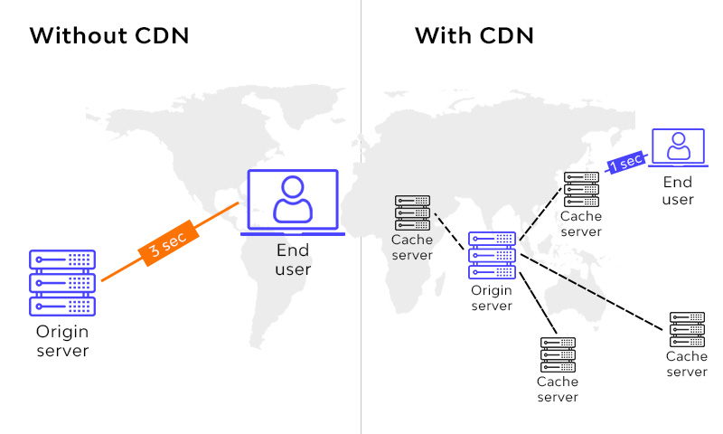

# Content Delivery Network

👆🏽 Группа особым образом настроенных серверов, расположенных в разных геоточках

&emsp;&emsp; 🔹 CDN сервера расположенные в разных точках геоточках, хранят кеш данных с оригинального сервера   

&emsp;&emsp; 🔹 Возвращающая данные с ближайшего по расстоянию серверу, ускоряющая процесс получения данных

&emsp;&emsp; 🔹 Распределяет нагрузку между серверами, позволяя справиться с большим кол-вом запросов, паралельно защищая сервер от легких`DDOS атаками` 

 

### ⟵ **<a href="../../readme.md">Назад</a>**