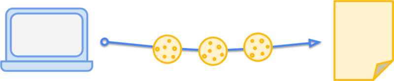

# HTTP Cookie
  
👆🏽 Небольшая строка, которая хранится на в браузере, и отправляется с каждым `http` запросом  

 ❓ В каком формате хранятся данные в куках?

---

Заголовки куки это обычная строка, которую пишут соблюдая определенные правила, позволяющий записывать и доставать данные в сроку по ключу   

👆 Так как кука это строка, ее можно использовать для хранения json объектов  

---

 

 ❓ Какие данные обычно хранят в куках? 

---

В основном в куках хранять 

1. Авторизационные данные   
2. Какую-то аналитику  
3. Какие-то данные, необходимые на всех страничках, по типу данных из корзины  

---

 

 ❓ Куки можно изменять только со стороны клиента? или только со стороны сервера? 

---

Куки можно изменять как со стороны клиента, так и со стороны сервера

---

 

 ⭐❓ Получается, в таком случаи хранить авторизационные данные в куках не безопасно, так как они могу быть похищенны или подменены

---

По факту да, но если при записи куки на сервере установить флаг `http-only`, то клиентские скрипты полностью теряют доступ к этой куке   

---

 

 ❓ Какой максимальный вес куки? 

---

Не более `4кб`   
👆 Это примерно 4 тыс символов  

---

 

 ❓ Какое максимальное кол-во ключей кук на одном домене? 

---

🎯 У каждого браузера свои рамки   
🎯 По этому +- 20 ключей считается безопасным значением  
🎯 Дальше уже может работать не стабильно в зависимости от браузера       

---

 

 ❓ За что отвечает пропса <code>path</code>

---

🎯 `path`, указывает на каких страничках будет доступна кука

---

 

 ⭐❓ Можно ли получить куку с одного домена, на другом? 

---

Нет, получить куку с одного домена на другом нельзя    
&emsp;&emsp; 🎯 Но есть возможность получать куку на дочерних поддоменах            
&emsp;&emsp; 🎯 Для этого нужно явно прописать этото в пропсе `domains`      
&emsp;&emsp;&emsp;&emsp; 👆 Поумолчанию кука доступна только в родительском домене   

---

 

 ⭐❓ Как можно защитить куку от перехвата злоумышкленниками по пути клиент - сервер

---

Можно указать в куках флаг `secure`, гарантирующий передачу кук только по защищенному `https` протоколу 

---

 

 ⭐❓ Какая разница между пропсами <code>expires</code> и <code>max-age</code> ?

🎯 `expires`, Указывает точную дату удаления кук в формате `date.toUTCString()`

🎯 `max-age`, Указывает через какое кол-во секунд с момента установки куки удалить ее  

 ⭐❓ Если указанны оба пропса, когда удалится кука?

---

Когда указанно в `max-age`, так как у него приоритет

---

 

 ❓ Как удалить куку ?

---

Достаточно указать `max-age` 0 или -1

---

 

 ⭐❓ Что такое сессионные куки?

---

🎯 `сессионные куки`, куки в которых при установке не указали дату удаления(`expires|max-age`)    
&emsp;&emsp; 👆 Такие куки удаляться сразу после закрытия браузера

---

 

 ⭐❓ За что отвечает пропса <code>SameSite</code> в куках?

---

`SameSite` запрещает передачу кук на сервер, если запрос произошел с тем же доменном верхнего уровня + 1, как и у сервера, с учетом протокола  

`https://___example.com`

 ⭐❓ Какие значения бывают у <code>SameSite</code>

---

🎯 `strict`      
&emsp;&emsp; 👆 Строго запрещает передавать куки запросам с не совпадающими доменом верхнего уровня, + протоколом     

🎯 `lax`        
&emsp;&emsp; 👆 Запрещает передавать только куки при использовании `post` запросов  

🎯 `none`
&emsp;&emsp; 👆 Дает полную свободу отправления кук с разных доменов

---

`sameSite=lax` дает поверхностную защиту от `csrf` атак, так как есть ряд обходных путей обойти эту защиту, например:  
 
🎯 Изменение метода запроса, используя `get` параметры (так можно делать в симфони)     

---

 
  

📗 На практике

🎯 Это удобный инсрумени для авторизации    
🎯 Клиент авторизовался, записал свой код авторизации на беке      
🎯 Бек с каждым запросом с клиента будет его читать и проверять      
🎯 Злоумышленник с клиента получить эту куку не сможет   
&emsp;&emsp; 👆 Так как она записана и читается только на беке 

 

### ⟵ **<a href="../../readme.md">Назад</a>**
