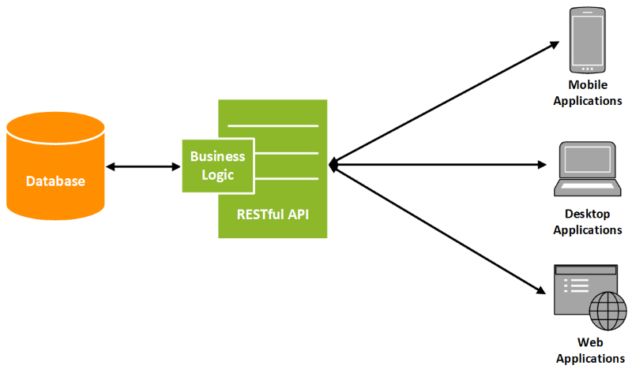

# REST FULL API

<a href="https://www.youtube.com/watch?v=EaFr0wYaxxM&t=37s">REST</a>  

 ❓ Что значит <code>Rest full API</code>

---

👆🏽 Это `API` работающее по правилам `rest`

---

 ⭐❓ В чем заключаются правила <code>Rest</code>?

---

🔹 `Stateles` - Отсутствие состояния      
&emsp;&emsp; 👆 Каждый новый запрос должен быть сформирован так, буд-то это их первый контакт     

🔹 `Caching` - Кеширования  
&emsp;&emsp; 👆 Сервер должен почечать редко обновляемые данные, дабы снизить нагрузку   

🔹 `Uniform Interface` - Единобразие интерфейса      
&emsp;&emsp; 🎯 Каждая сущность должна иметь свой `URI`       
&emsp;&emsp; 🎯 При этом использовать один `URI` для всех операций с сущностью         
&emsp;&emsp;&emsp;&emsp; 👆 Операцию с сущностью должны описывать методы    

🔹 Манипуляция через представление   
&emsp;&emsp; 🎯 Клиент полность передает то как он видит сущность, а не только то что он хочет поменять    
&emsp;&emsp;&emsp;&emsp; 👆 А сервер уже решает какие данные обрабатывать 

🔹 `Self-descriptive message` - Самоописывающие сообщения
&emsp;&emsp; 👆 Все ответы от `Rest Full API` сразу дают четкие инструкции как их обрабатывать    
&emsp;&emsp;&emsp;&emsp; 👆 Код ответа, в каком формате и тд  

🔹 `HyperMedia` - Гипер медиа, как двигатель состояния   
&emsp;&emsp; 👆 Ответы от сервера, содержат подсказки о возможных дальнейших действиях клиента   

🔹 `Layered system` - Принцип многоуровности системы   
&emsp;&emsp; 🎯 Говорит о том, что в процессе общения могут быть не только клиент и сервер      
&emsp;&emsp;&emsp;&emsp; 👆 А еще различные микросервисы, прокси и балансировщики   

&emsp;&emsp; 🎯 При этом каждый элемент системы должен знать и зависить только от радом стоящей сущности, и быть связанный с ней контрактом  

🔹 `Code on Demand` - Код по запросу     
&emsp;&emsp; 🎯 Опциональное правило, говорящее о том что сервер может прислать исполняемый код в ответе  

Следование всем этим правилам позволит писать понятное и предсказуемое `API`, и может называтся `REST FULL API`

---

 

 ❓ Назови методы <code>Rest full API</code>

 🔹 GET  
&emsp;&emsp; 👆 Получение данных

 🔹 POST  
&emsp;&emsp; 👆 Создание данных

 🔹 PUT  
&emsp;&emsp; 👆 Изменет сущность полностью на то что передали в запросе

 🔹 PATCH  
&emsp;&emsp; 👆 Изменет только те поля что передали, остальное останеться неизменным

 🔹 DELETE  
&emsp;&emsp; 👆 Удалит

 

 ❓ Какие бывают коды ответа?

 🔹 `1XX`  
&emsp;&emsp; 👆 Информационные

&emsp;&emsp;&emsp;&emsp; 🎯 `101`  
&emsp;&emsp;&emsp;&emsp;&emsp;&emsp; 👆 Сокет соединение успешно

 🔹 `2XX`  
&emsp;&emsp; 👆 Успешно выполненные

&emsp;&emsp;&emsp;&emsp; 🎯 `200`  
&emsp;&emsp;&emsp;&emsp;&emsp;&emsp; 👆 Запрос прошел успешно

&emsp;&emsp;&emsp;&emsp; 🎯 `201`  
&emsp;&emsp;&emsp;&emsp;&emsp;&emsp; 👆 Запрос на создане прошел успешно

&emsp;&emsp;&emsp;&emsp; 🎯 `204`  
&emsp;&emsp;&emsp;&emsp;&emsp;&emsp; 👆 Запрос прошел успешно, но данных в ответе не ождается  

 🔹 `3XX`  
&emsp;&emsp; 👆 Редиректы

&emsp;&emsp;&emsp;&emsp; 🎯 `307`  
&emsp;&emsp;&emsp;&emsp;&emsp;&emsp; 👆 Временный редирект  

&emsp;&emsp;&emsp;&emsp; 🎯 `308`  
&emsp;&emsp;&emsp;&emsp;&emsp;&emsp; 👆 Постоянный редирект

 🔹 `4XX`  
&emsp;&emsp; 👆 Ошибка клиента

&emsp;&emsp;&emsp;&emsp; 🎯 `400`  
&emsp;&emsp;&emsp;&emsp;&emsp;&emsp; 👆 Не заполенные обязательные поля формы

&emsp;&emsp;&emsp;&emsp; 🎯 `401`  
&emsp;&emsp;&emsp;&emsp;&emsp;&emsp; 👆 Действия доступны только авторизированным пользователям

&emsp;&emsp;&emsp;&emsp; 🎯 `403`  
&emsp;&emsp;&emsp;&emsp;&emsp;&emsp; 👆 Не достаточно прав для действия  

&emsp;&emsp;&emsp;&emsp; 🎯 `404`  
&emsp;&emsp;&emsp;&emsp;&emsp;&emsp; 👆 Страничка не найденна  

&emsp;&emsp;&emsp;&emsp; 🎯 `429`  
&emsp;&emsp;&emsp;&emsp;&emsp;&emsp; 👆 Превышен лимит запросов  

 🔹 `5XX`  
&emsp;&emsp; 👆 Ошибка сервера

&emsp;&emsp;&emsp;&emsp; 🎯 `500`  
&emsp;&emsp;&emsp;&emsp;&emsp;&emsp; 👆 Ошибка на сервере 

&emsp;&emsp;&emsp;&emsp; 🎯 `503`  
&emsp;&emsp;&emsp;&emsp;&emsp;&emsp; 👆 Сервер не доступен

&emsp;&emsp;&emsp;&emsp; 🎯 `504`  
&emsp;&emsp;&emsp;&emsp;&emsp;&emsp; 👆 Превишено время ожидания  

 

### ⟵ **<a href="../../readme.md">Назад</a>**
    