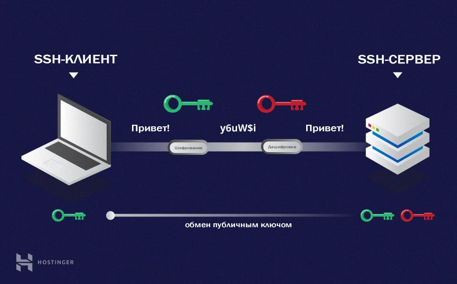

# SSH

 ❓ Что такое SSH

---

Безопасный протокол для передачи данных между клиентом и сервером, использующий ассиметричное шифрование    

---

 ⭐❓ Расскажи алгоритм шифрования данных по <code>SSH</code>

---

🔹 Мы генерируем на обеих машинах пары ключей    
&emsp;&emsp; 🎯 `Публичные`:`id_rsa.pub`    
&emsp;&emsp;&emsp;&emsp; 👆 Передается на сервер в открытом виде

&emsp;&emsp; 🎯 `Приватный`:`id_rsa`  
&emsp;&emsp;&emsp;&emsp; 👆 Храниться локально

🔹 Передаем публичный ключь на сервер   

🔹 Теперь сервер может передать нам все данные в зашифрованном виде   
&emsp;&emsp; 👆 Которые можно расшифровать только нашим локальным ключем

🔹 При установке `ssh` соединения с сервером, он передает нам свой публичный ключь в зашифрованом виде   
&emsp;&emsp; 👆 Который мы сможем расшивровать своим локальным ключем  
&emsp;&emsp; 👆 И использовать в дальнейшем для шифрования передаваемых данных      

🔹 В итоге у обеих сторон есть публичные ключи для шифрования передачи данных   

🔹 А так же приватные ключи на каждой из сторон, что бы расшифровать переданные данные  
&emsp;&emsp; 👆 Таким образом передача данных может быть безапасной, даже через не безопасное `wifi` соединение    
  

---

 

### ⟵ **<a href="../../readme.md">Назад</a>**