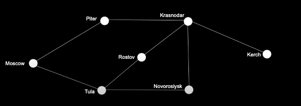

# Поиск в ширину
> Алгоритм поиска кратчайшей точки в графах



💠 Графы   
👆🏽 Структура данных, описывающая связанные между собой точки

&emsp;&emsp; 🔹 Точки называют вершинами

&emsp;&emsp; 🔹 Связывающие линии - ребра

&emsp;&emsp; 🔹 Графы бывают однонапрвленные и двунаправленные

&emsp;&emsp; 🔹 В у каждой вершины есть массив других вершин, к которым она прилегает ребрами

<br>

```javascript
const graph = {
    moscow: ['piter', 'tula'],
    piter: ['krasnodar'],
    tula: ['rostov', 'noworosiysk'],
    rostov: ['krasnodar'],
    noworosiysk: ['krasnodar'],
    krasnodar: ['kerch']
}

function breadthSearch(graph, start, end) {
    let queue = [],      // 👉🏼 Очередь (первый вошел, первый вышел)
        count = 0

    queue.push(start)   // 👉🏼 Помещаем в очередь точку старта

    while (queue.length > 0) {
        const current = queue.shift() // извлекаем последнюю вершину, добавленную в очередь
        ++count

        if (!graph[current]) { // Добавить вершину старта в граф, без прелегающих ребер, если ее там не было
            graph[current] = []
            return 0
        }

        if (graph[current].includes(end)) {// Вернуть true, если в точку end можно вернуться через одно ребро
            return count
        } else {
            // Добавить смежные вершины в очередь, что бы узнать можно ли попасть в точку назначения через них
            // Цикл будет крутиться, до тех пор, пока в очередь не попадет вершина, через которую можно добраться до точки end
            queue = [...queue, ...graph[current]]
        }
    }

    return count
}

console.log(breadthSearch(graph, 'moscow', 'kerch'))
```

<br>

### ⟵ **<a href="../../readme.md">Назад</a>**