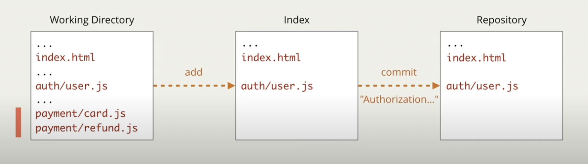
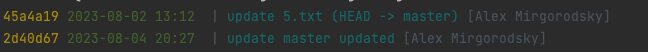
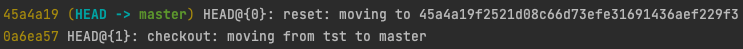
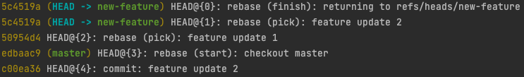
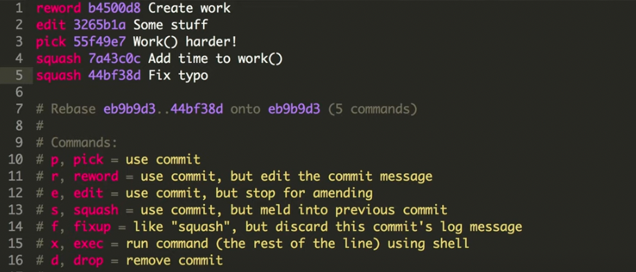

# GIT

<details>
<summary> 1. Что такое <code>git config</code>, какой бывает, зачем он нужен</summary>


🔹 Файл конфигурации, из которого `git` берет дополнительную информацию  
&emsp;&emsp; 🎯 Алиасы  
&emsp;&emsp; 🎯 Игноры  
&emsp;&emsp; 🎯 Данные автора  
&emsp;&emsp; 🎯 Формат логов  
&emsp;&emsp; 🎯 Редактор  


🔹 Бывают трех видов  
&emsp;&emsp; 🎯 `--system` на всех пользователей `PC`  
&emsp;&emsp; 🎯 `--global` на конкретного пользователя `PC`  
&emsp;&emsp; 🎯 `--local` на каждый проект  
&emsp;&emsp; 🛑 Инклудят друг друга от `--system` до `--local`    


</details>

<details>
<summary>2. Какие статусы бывают у файлов в гите</summary>


🔹 `Untracked`  
&emsp;&emsp; 👆 Файл не отслеживаеться гитом при любых манипуляциях с репозиторием

🔹 `Stage for commit`  
&emsp;&emsp; 👆 Либо `Untracked` добавленный в `WorkDirectory`, либо файл уже лежащий в репозитории, но измененный (`modified`)

🔹 `Comited`  
&emsp;&emsp; 👆 Уже закомиченные файлы


</details>

<details>
<summary>3. Как удалить файл из индекса</summary>


🔹 `git rm <filename>`

&emsp;&emsp;   🎯 Флаг `--cached`, удалит файл из гита но оставит локально    

&emsp;&emsp;   🎯 Флаг `--f`, удалит файл полностью


</details>

<details>
<summary> 4. Как исправить последний комит</summary>


```shell
git commit --amend -m "commit message"
```


</details>

<details>
<summary> 5. Как исправить уже запушенный последний комит</summary>


🎯 Если ветка изолированна    
```shell
git commit --amend -m "commitMessage"
git push --force origin master
```

🎯 Если ветка уже используеться другими разработчиками  
&emsp;&emsp; 👆 Добавить новый комит с исправлениями, и сделать `squash`   


</details>

<details>
<summary> 6. Подтянуть новые ветки, созданные в удаленном репозитории </summary>


```shell
git fetch
```


</details>

<details>
<summary> 6.5 Знаешь ли какие-то способы обращаться к комиту, по мимо хеша и имени ветки?</summary>


🎯 `@`    
&emsp;&emsp; 👆 Сокращение от `HEAD`

🎯 `~`    
&emsp;&emsp; 👆 Указывает на один коммит назад от `HEAD`


<br>

```shell
git show @~2 index.html
```
👆 Покажет изменения сделанные 2 комита назад от `HEAD`


</details>

<br>

---

<br>

<details>
<summary>7. Как переключиться на другую ветку</summary>


```shell
git checkout branch
```


</details>

<details>
<summary>8. Как переключиться на другую ветку удалив не закомиченные изменения</summary>


```shell
git checkout -f master
```


</details>

<details>
<summary>9. Что будет с незакомичеными изменениями сделаной на одной ветке, при переключении на другую</summary>


🔹 `untracked` так и остануться в проекте  

🔹 `modified`

&emsp;&emsp; 🎯 Если до измененный файл идентичен на обеих ветках, то изменения перенесуться, так же в состоянии `modified`  

&emsp;&emsp; 🎯 Если файл из `HEAD` до изменения и файл на переключаемой ветке не идентичны, переключения без `checkout -f branchName` не произойдет    

&emsp;&emsp;&emsp;&emsp; 🛑 `checkout -f branchName` переключит проект в состояние указанной ветки, стерев все незакомиченные `modified` изменения, `untracked` удалены не будут 


</details>

<details>
<summary> 10. Отменить все незакомиченые изменения</summary>


```shell
git checkout -f
```
👆 Перезапишет все файлы в состояния из `HEAD` ветки, удалив незакомиченные изменения

---

```shell
git stash save 'stashName' 
```
👆 Скинет все незакомиченные изменения в буфер 


</details>

<details>
<summary> 11. Что такое <code>detached HEAD</code>, как туда попасть, чем опасна, как исправить</summary>


👆 `detached HEAD`, состояние когда репозиторий смотрит не на ветку, а просто на комит, не закрепленный вершиной ветки  
  
&emsp;&emsp; 🎯 Можно попасть туда выполнив `git checkout 'commitHash'` 

&emsp;&emsp; 🎯 При смене ветки, легко потерять хеш своего комита

&emsp;&emsp; 🎯 При смене ветки, через некоторое время недостижимые комиты удаляються 

&emsp;&emsp; 💊 Если в состоянии `отделенный HEAD` были сделаны коммиты, то это можно исправить выполнив следующие действия:

&emsp;&emsp;&emsp;&emsp; 🎯 Записать список комитов сделанных в `detached HEAD`, `git log`  
&emsp;&emsp;&emsp;&emsp; 🎯 Создать и переключиться на новую ветку `git checkout -b 'branchName'`  
&emsp;&emsp;&emsp;&emsp; 🎯 Перетащить коммиты сделанные в `detached HEAD` в новую ветку при помощи `git cherry-pick 'commitHash'`  


</details>

<br>

---

<br>


<details>
<summary> 12. Что такое <code>git stash</code>, в каких случаях применяют </summary>


```shell
git stash save 'stashName'
```


👆 `stash` буфер обмена в `git`, который применяют в следующих случаях:  
  
&emsp;&emsp; 🎯 Наработки в достаточно сыром виде для комита, но нужно срочно переключиться на другую задачу, и не потерять наработки     

&emsp;&emsp; 🎯 Перетянуть не закомиченые наработки на другую ветку

<br>

📗 `-u` закинет в `stash` `untracked` файлы 


</details>

<details>
<summary> 13. Что такое <code>reflog</code> | Как получить хеши недостежимых комитов</summary>


```shell
git reflog --oneline
```
👆 Более детальная локальная история операций между ветками и комитами, где можно найти хеши недостижимых комитов   


</details>

<details>
<summary> 14. Как делать откаты комитов | Что такое <code>git reset</code></summary>


```shell
git reset --'mod' 'commitHash'
```
👆🏽 Команда которая переносит вершину ветки, на узказанный коммит, переводя файлы которые отличаються между переключаемыми комитами в состояния зависящае от указанного флага   




🔹 `--soft`  
&emsp;&emsp; 👆 Переносит вершину ветки на указанный коммит, переводя отличающиейся файлы в состояние `stage area`, включая не закомиченные

🔹 `--mixed`  
&emsp;&emsp; 👆 Переносит вершину ветки на указанный коммит, переводя отличающиейся файлы в состояние `work dirrectory`, но не добавленно в `stage area`, включая не закомиченные

🔹 `--hard`  
&emsp;&emsp; 👆 Переносит вершину ветки на указанный коммит, не цепляя с собой никаких данных из уходящего комита      
&emsp;&emsp;&emsp;&emsp; 🛑 Все незакомиченные данные будут стерты

🔹 `--keep`  
&emsp;&emsp; 👆 Переносит вершину ветки на указанный коммит, переводя только незакомиченные данный в `workDirectory`, но добавленно в `stage area`        
&emsp;&emsp;&emsp;&emsp; 👆 Аналогична команде `--hard`, но может быть полезно когда важно не потерять не закомиченные данные, или просто примерять не закомиченные данные на указанный комит


</details>

<details>
<summary> 15. Как вернуться к недостежимому комиту, с которого мы сделали <code>reset</code>?</summary>


🎯 Получаем `id` `HEAD` комита - `45a4a19`
```
git log
```    


---

🎯 Ищем в `reflog` операцию `reset` операцию перехода на комит `45a4a19`
```shell
git reflog --oneline
```


---

🎯 Копируем комит лежащий до `reset` операции - `0a6ea57 HEAD@{1}`   

🎯 Делаем `reset` на него    
```shell
git reset --keep @{1}
```


</details>

<details>
<summary> 15.5. Как быстро откатиться на прошлый коммит? | Что такое <code>ORIG_HEAD</code> </summary>


```
git reset --hard ORIG_HEAD
```


</details>

<br>

---

<br>

<details>
<summary> 16. Что такое <code>merge</code> | Как обьединить две ветки</summary>


```shell
git merge feature
```
👆 Обьединение двух веток


</details>

<details>
<summary>17. Какие виды слияния бывают</summary>


🎯 `fast-forward` - перемотка      
&emsp;&emsp; 👆 Быстрое слияние, при помощи перемотки вершины `master` ветки, к вершине `feature`    
&emsp;&emsp; 🛑 Возможна только в том случаи, если в ветку `master`, больше не делали комитов, с тех пор как от нее была создана `feature`   
  
🎯 `Истиное слияние`      
&emsp;&emsp; 👆 Создание нового комита, для слияние двух веток   
  


</details>

<details>
<summary> 18. Как выйти из состояния прерванного слияния</summary>


🎯 `git reset --hard`   
&emsp;&emsp; 👆 Откинет на состояние ветки, до попытки слияни, но сотрет все незакомиченные изменения в `workDirectory`

🎯 `git reset --merge`   
&emsp;&emsp; 👆 Откинет на состояние ветки, до попытки слияни, но сохранит все незакомиченные изменения, которые не учавствовали в слиянии

🛑 Лучше сделать комит перед мерджем, так как при откате можно запутаться, а лишний коммит потом засквошить


</details>

<details>
<summary> 19. Откатить изменения <code>merge request</code></summary>


```shell
git reset --hard 'comitHashBeforeMergeRequestOnBranch'
```
👆 Переключиться на комит до комита слияния


</details>

<br>

---

<br>

<details>
<summary> 20. Как подтянуть изменения, без дополнительного слияния | Что такое <code>rebase</code></summary>


👆 Слияние веток, без дополнительного коммита слияния, путем набрасывания комитов ветки `feature`, над вершиной ветки `master`, с последующим смещением указателя вершины `feature` на самый последний коммит наброшенный над `master`

&emsp;&emsp; 🎯 Комит который делает идентичные изменения в `feauter` и `master`, будет пропущен при накидывание поверх `master`

&emsp;&emsp; 🎯 `rebase` накидывая комиты на `master` меняет хеши всех комитов из `feature`

&emsp;&emsp; 🎯 С `rebase` без `reflog` невозможно отследить когда были подтянуты изменения из `master`

&emsp;&emsp; 🎯 `rebase` лучше всего использовать только когда работаешь один над `feature` веткой


</details>

<details>
<summary> 21. При подтягивании обновлений из <code>master</code> ветки, исчез комит сделаный в <code>feature</code> ветки, куда он мог исчезнуть?</summary>


&emsp;&emsp; 👆 Комит не исчез, а просто небыл добавлен при перебазировании, так как идентичные изменения уже были в истории `master`     
&emsp;&emsp;&emsp;&emsp; 🎯 Комит который делает идентичные изменения в `feauter` и `master`, будет пропущен при накидывание поверх `master`


</details>

<details>
<summary> 22. Как продолжить <code>rebase</code>, после решения конфликта</summary>


```shell
git add .
git rebase --continue
```
🎯 Добавить новые изменения после решения конфликта в `stage area`      
🎯 Продолжить перебазирования с новыми изменениями


</details>

<details>
<summary> 23. Как отменить <code>rebase</code> если в процессе произошел конфликт</summary>


```shell
git rebase --abort
```
👆 Если в процессе перебазирования произойдет конфликт, слияние остановиться, и проект останеться в состоянии `отделенный HEAD`

<br>

❗ `git reset --hard` как в отмене обычно `merge request` неподходит   
&emsp;&emsp; 👆 Так как не откатит `HEAD` из `detached HEAD` обратно на старую вершину `feature`


</details>

<details>
<summary> 24. Как отменить успешно завершенный <code>rebase</code></summary>


🔹 Взять хеш комита из константы, куда сохряняеться хеш комита перед `merge|reset|chechout|rebase`
```shell
git reset --hard ORIG_HEAD
```

<br>

🔹 Самый надежный способ это найти в `reflog` комит с ремаркой `rebase(start)`, и взять хеш комита лежащий перед ним

```shell
git reset --hard c00ea36
```
&emsp;&emsp; 👆 Так как впроцессе ребейза `ORIG_HEAD` может быть переписан неправильным значением командами `merge|reset|chechout|rebase`


</details>

<br>

---

<br>

<details>
<summary> 25. Как переписать историю гита | что такое интерактивный ребейз</summary>


```shell
git rebase -i @~n # или ветка вместо @
```
👆 `n` число отображенных комитов от последнего



После переписывания истории нужно сделать `git push origin <branch> --force`  
&emsp;&emsp; 🛑 Важно указать идентификатор ветки в `<branch>`, иначе запушатся все локальные ветки `origin`


</details>

<details>
<summary> 26. Как подтянуть изменения ветки, не подтягивая ее историю комитов | Что такое <code>squash</code> </summary>


🔹 `squash`  

```shell
git merge --squash feature # Перетянет все изменения из feature векти в stage area
git add .
git commit -m"squash message"
```

🔹 `cherry-pick`  
```shell
git cherry-pick master..feature -n
git add .
git commit -m"commit message"
```


</details>

<details>
<summary> 27. Как подтянуть только нужные комиты из ветки | Что такое <code>cherry-pick</code></summary>


```shell
git cherry-pick 'commitHash'
```
👆 Добавить коммит `commitHash` над `HEAD` веткой

&emsp;&emsp; 🔹 `-n` флаг     
&emsp;&emsp;&emsp;&emsp; 👆 Подтянет изменения в `workDirectory`, но без комита

<br>  

```shell
git cherry-pick master..feature
```
👆 Скопировать все комиты из `feature`, которых нет в `master`


</details>

<br>

---

<br>

<details>
<summary> 28. Как отменить комит, который уже есть в удаленном репозитории | Что такое <code>revert</code></summary>


```shell
git revert 'commitHash'
```
👆 Отменение комита, наложением нового комита, стирающего выполненные действия


</details>

<br>

---

<br>

<details>
<summary> 29. Какие методологи ведения истории проекта знаешь</summary>


🔹 Релизные    
&emsp;&emsp; 🎯 Хранит в репозитории несколько версия проекта     
&emsp;&emsp; 🎯 Разработка всех фичь ведеться в master, сливая каждый пул наработок в отдельный релиз  
&emsp;&emsp; 🎯 Релизная ветка сохраняет совое состояние на момент релиза, и уже не зависит от изменений в `master`  
&emsp;&emsp; 🎯 Любые изменения релизной ветки делаються путем создания новой версии релизонй ветки     

🔹 Тематические    
&emsp;&emsp; 👆 Ведеться одна `master` ветка, куда подливаються тематические ветки `feature` и `bugfix`   

🔹 Git flow  
&emsp;&emsp; 👆 Методология обьединяющая тематическую и релизную стратегию     
  


</details>

<details>
<summary> 30. Раскажи подробней о git flow</summary>


🔹 `Main`      
&emsp;&emsp; 👆 Продакшн ветка  
  
<br>

🔹 `Develop`  
&emsp;&emsp; 👆 Хранит в себе набор всех фич и багфиксов перед релизом

<br>

🔹 `Release`  
&emsp;&emsp; 👆 Фиксирует в себе список наработок релиза, позволяя отдельно тестировать пул наработок, и не блокировать новый поток фич в `develop`

&emsp;&emsp; 🛑 После правки всех фиксов, релиз ветку сливают как в `master`, так и в `dev`  
&emsp;&emsp;&emsp;&emsp; 👆 Что бы получить фиксы из релиза в разработке

<br>

🔹 `Hotfix`    
&emsp;&emsp; 👆 Ветки для быстрого исправления продашкеша, минуя весь флоу

&emsp;&emsp; 🛑 Так же льються в `dev`   
&emsp;&emsp;&emsp;&emsp; 👆 Что бы не потерять фиксы при след релизах


</details>

<br>

---

<br>

### ⟵ **<a href="../../readme.md">Назад</a>**