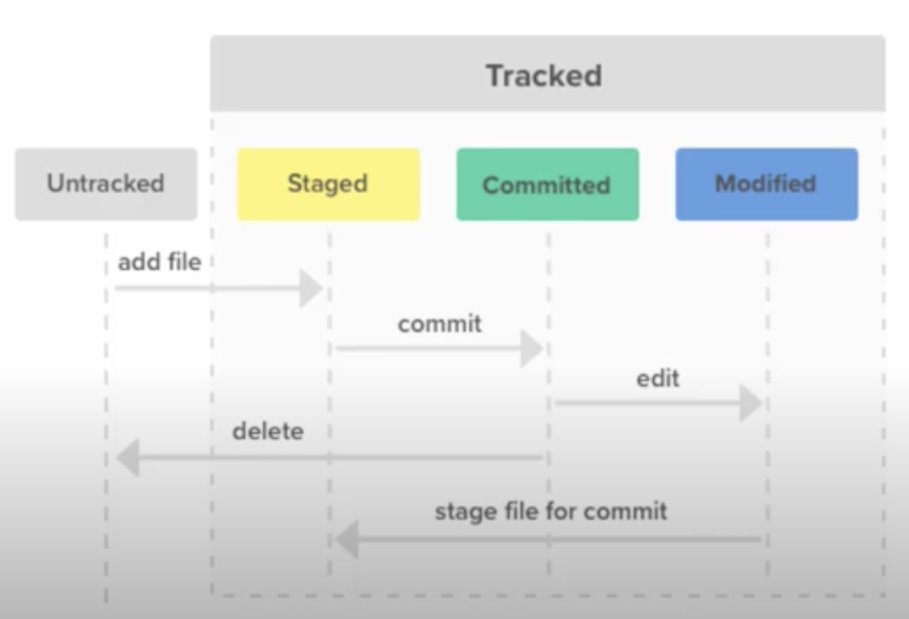

# GIT

<details>
<summary> Что такое <code>git config</code>, какой бывает, зачем он нужен</summary>


🔹 Файл конфигурации, из которого `git` берет дополнительную информацию  
&emsp;&emsp; 🎯 Алиасы  
&emsp;&emsp; 🎯 Игноры  
&emsp;&emsp; 🎯 Данные автора  
&emsp;&emsp; 🎯 Формат логов  
&emsp;&emsp; 🎯 Редактор  


🔹 Бывают трех видов  
&emsp;&emsp; 🎯 `--system` на всех пользователей `PC`  
&emsp;&emsp; 🎯 `--global` на конкретного пользователя `PC`  
&emsp;&emsp; 🎯 `--local` на каждый проект  
&emsp;&emsp; 🛑 Инклудят друг друга от `--system` до `--local`    

<details>
<summary> 🧠 Образ для заучивания</summary>

---

Алисы игнорят данные разработчика для редактора в системе глобальной локализации   

---

</details>


</details>

<details>
<summary>Какие статусы бывают у файлов в гите</summary>




Если начать с верхов то у нас есть: 

`Workin Directory`  
👆 Это локальное состояние проекта     

---
  
в `Workin Directory` лежат файлы в двух состояниях 

🎯 `Tracked`      
🎯 `Untracked`
 

---

В гите работает двух ступенчатая система комитов   
&emsp;&emsp; 🎯 Сначала добавить в `stage`   
&emsp;&emsp; 🎯 После закомитить


👆 По этому у `tracked` файлов есть три состояния  

---

🎯 `stage|index|stage area| stage for commited`    
👆 Очередь файлов на комит  

🎯 `modiffied`   
👆 Измененные проиндексированные файлы, но не добавленные в очередь  

🎯 `commited`   
👆 Закомиченные нетронутые файлы   

<details>
<summary> <sup>⭐</sup>❓ Для чего двух ступенчатая система комита?</summary>

---

Индекс в этой схеме сделан как пространство куда можно скинуть готовые к коммиту `untacked` или `modiffied` файлы, а после закомитить   

---

</details>


<details>
<summary>📚 lessons</summary>

___    

<a href="https://www.youtube.com/watch?v=VUs1mNUBjvk">git states</a>  

___

</details>


</details>

<details>
<summary>Как удалить файл из индекса</summary>


🔹 `git rm <filename>`

<details>
<summary> <sup>⭐</sup>❓ Как удалить файл из гита, но оставить локально?</summary>

---

🎯 Флаг `--cached`, удалит файл из гита но оставит локально

🎯 Флаг `--f`, удалит файл полностью

---

</details>

<details>
<summary> 🧠 Образ для заучивания</summary>

---

🎯 Гид едет на машине(`рм-рм`)
🎯 Находит файл  
🎯 Если с файла стоящий и с него можно заработать кеш(`--cached`), он его закешит   
🎯 Если файл прям не нужен, он говорит фуу(`-f`)    


---

</details>


</details>

<details>
<summary> Хранит ли гит пустые папки?</summary>


Нет 

<details>
<summary> <sup>⭐</sup>❓ Как заставить гит хранить папку?</summary>

---

Положить в нее пустой файлик `.gitkeep`    
&emsp;&emsp; 👆 Соглашение между разработчиками  

---

<details>
<summary> 🧠 Образ для заучивания</summary>

---

🎯 Жадный еврей смотрит на папку       
🎯 Вроде пустая, но может пригодится      
🎯 Положу ка туда свою кипу(`keep`), что бы и папку не выбрасывать, и пользу приносила  

---

</details>

</details>


</details>

<details>
<summary>Как сделать что бы после того как мы подтянули файл из репо, гит не отслеживал его измененния?</summary>


```
git update-index --assume-unchanged <path-to-file>  
```

👆 После выполнения этой команды, гит перестанет видить изменения сделанные в этом файле локально    
  
<details>
<summary> <sup>⭐</sup>❓ Зачем это может быть нужно?</summary>

---

🎯 `build` должен хранится в репо      
🎯 При `dev` разработке билд постоянно меняет хеш внутри       
🎯 Эти изменения не должны попадать в репо   

Применив команду `assume-unchanged`, изменения происходят, но гит их не видит  

---

</details>

<details>
<summary> <sup>⭐</sup>❓ Что делать, если настало время внести какие-то изменения в <code>build</code>?</summary>

---

🎯 Отменяем команду игнорирования изменений      
```
git update-index --no-assume-unchanged <path-to-file>  
```

🎯 После этого все изменения в файле будут отображены

<details>
<summary> 🎯 После этого лучше привести файл в состояние репо</summary>

----

```
git reset --hard <path-to-file>
```

----

</details>


🎯 Сделать нужные изменения в файлах         
🎯 И закомитить   

---

</details>

<details>
<summary> <sup>⭐</sup>❓ Какие могут быть сложные баги?</summary>

---

🎯 В файл под `assume-unchanged` внесли изменения в репо   
🎯 Разработчик апдейтит этот файл       
🎯 `git` ругается, что в файле есть измененния       
🎯 При попытке увидить их через `git status`, их не увидить      


---

</details>

<details>
<summary> <sup>⭐</sup>❓ Как лечить?</summary>

---


<details>
<summary> 🎯 Достаточно снять игнорирование изменений</summary>

----

```
git update-index --no-assume-unchanged <path-to-file>  
```

----

</details>

 
<details>
<summary> 🎯 Привести файл к состоянию репозитория</summary>

----

```
git reset --hard <path-to-file>
```

----

</details>

       


<details>
<summary> 🎯 Апдейтить файл </summary>

----

```
git pull
```

----

</details>

<details>
<summary> 🎯 Сделать файл вновь не отслеживаемым</summary>

----

```
git update-index --assume-unchanged <path-to-file>
```

----

</details>

---

</details>

<details>
<summary> <sup>⭐</sup>❓ Как решать такие вещи по другому?</summary>

---

Хранить `example` версии, которые обязывают каждого создавать `prod` версии, которые лежат в `.gitignore`, как на серве так и на локалке   

---

</details>

<details>
<summary> 🧠 Образ для заучивания</summary>

---

🎯 На нашем `пк` гиду(`git`) об изменении индекса(`update index`) сообщает изюм(`--assume`), изменяя id каждому файлу              
🎯 Если нужно сказать что за изменениями каких файлом резпозиталрия сейчас не нужно следить        
🎯 Говорим гиду(`git`), гит есть требования по изменению идекса(`update-index`)      
🎯 Скажи изюму, изюм. не изменяй айдишники указанным файлам(`--assume-unchange`), что бы гиту не прилетали оповещение о ненужных ему обновлениях   


🎯 Если гит хочет видить обновления которые от него скрывал изюм  
🎯 Достаточно сказать гиту, гит есть изменения по работе с изменением индекса, скажи изюму, нет изюм, больше не нужно делать эти файлы неизменяемыми

---

</details>


</details>

<details>
<summary> Как исправить последний комит</summary>


```shell
git commit --amend -m "commit message"
```

<details>
<summary> 🧠 Образ для заучивания</summary>

---

🎯 Когда мы вносим мелкие правки в фичу новым комитом   
🎯 История начинает быть похожа на помет      
🎯 Но если не добавлять сверху новый коммит а просто изменить предыдущий       
🎯 То история будет выглядеть не как помет, а как мед(`amend`)        

---

</details>


</details>

<details>
<summary> Как исправить уже запушенный последний комит</summary>


🎯 Если ветка изолированна    
```shell
git commit --amend -m "commitMessage"
git push --force origin master
```

<details>
<summary> 🧠 Образ для заучивания</summary>

---

🎯 Хотим сделать что бы история была не помет, а мед(`ammend`)      
🎯 Но последний коммит уже запушен, а изменять хеш последнего коммита на сервере, не так безопасно       
🎯 Если ветка изолирована, значит в последнем коммите нет необходимости       
🎯 Делаем историю словно мед(`ammend`), и убедившись что после коммит на серве нам не нужен с фразой"фух слава богу"(`-f`), пушим изменения


---

</details>

🎯 Если ветка уже используеться другими разработчиками  
&emsp;&emsp; 👆 Добавить новый комит с исправлениями, после всем обновиться и сделать `squash`   

<details>
<summary> 🧠 Образ для заучивания</summary>

---

🎯 Если над веткой работает несколько разрабов, менять хеш последнего комита на серве нельзя   
🎯 В таком случаи прийдется делать новый коммит       
🎯 Но после засинкаться с коллегами, и произвести wash - чистку истории комитов, от лишних комитов `squash`       

---

</details>


</details>

<details>
<summary> Подтянуть новые ветки, созданные в удаленном репозитории </summary>


```shell
git fetch
```

<details>
<summary> 🧠 Образ для заучивания</summary>

---

Фетчь не просто обновляет существующие ветки как `pull`, а помогает втечь(`fetch`) новым веткам с сервака на локальный `пк`  

---

</details>


</details>

<details>
<summary> Что означает <code>HEAD</code> в контексте <code>git</code>?</summary>


Комит на который сейчас указывает репозиторий

<details>
<summary> <sup>⭐</sup>❓ Как сокращенно обращатся к <code>HEAD</code>?</summary>

---

`@`

<details>
<summary> 🧠 Образ для заучивания</summary>

---

Собака которая в упряжке тянет разраба на нужный комит по истории

---

</details>

---

</details>

<details>
<summary> 🧠 Образ для заучивания</summary>

---

На какой комит сейчас смотрит голова разработчика  

---

</details>


</details>

<details>
<summary> Знаешь ли какие-то способы обращаться к комиту, по мимо хеша и имени ветки?</summary>


🎯 `@`    
&emsp;&emsp; 👆 Сокращение от `HEAD`

🎯 `~`    
&emsp;&emsp; 👆 Указывает на один коммит назад от `HEAD`


<br>

```shell
git show @~2 index.html
```
👆 Покажет изменения сделанные 2 комита назад от `HEAD`

<details>
<summary> <sup>⭐</sup>❓ Как отработает <code>git show @~ index.html</code></summary>

---

👆 Покажет изменения сделанные 1 комита назад от `HEAD`

---

</details>

<details>
<summary> <sup>⭐</sup>❓ Как отработает <code>git show @~1 index.html</code></summary>

---

👆 Покажет изменения сделанные 1 комита назад от `HEAD`

---

</details>

<br>

<details>
<summary> 🧠 Образ для заучивания</summary>

---

🎯 Тильда - Матильда, ведьма с кочергой   
🎯 Одной кочергой можно дотянутся до одного комита назад       
🎯 Но если связять 2 кочерги, то можно и на два коммита назад     
🎯 И так далее      


---

</details>


</details>

<br>

---

<br>

<details>
<summary>Как переключиться на другую ветку</summary>


```shell
git checkout branch
```

<details>
<summary> 🧠 Образ для заучивания</summary>

---

Получили чек на поезд везущий в другой город(`ветку`)

---

</details>


</details>

<details>
<summary>Как переключиться на другую ветку удалив не закомиченные изменения</summary>


```shell
git checkout -f master
```

<details>
<summary> 🧠 Образ для заучивания</summary>

---

🎯 Получили чек на скоростной `fast`(`-f`) поезд    
🎯 В таких поездах нельзя брать ссобой багаж(`modified` файлы)    
🎯 Но Рюкзак, сумку можно (`untracked|stage but not commited` файлы)  

---

</details>


</details>

<details>
<summary>Что будет с незакомичеными изменениями сделаной на одной ветке, при переключении на другую</summary>


🔹 `untracked` так и остануться в проекте  

🔹 `modified`

&emsp;&emsp; 🎯 Если до измененный файл идентичен на обеих ветках, то изменения перенесуться, так же в состоянии `modified`  

&emsp;&emsp; 🎯 Если файл из `HEAD` до изменения и файл на переключаемой ветке не идентичны, переключения без `checkout -f branchName` не произойдет    

&emsp;&emsp;&emsp;&emsp; 🛑 `checkout -f branchName` переключит проект в состояние указанной ветки, стерев все незакомиченные `modified` изменения, `untracked` удалены не будут 

<details>
<summary> 🧠 Образ для заучивания</summary>

---

🔹 Если получить чек на скоростной, то берем с собой только ручную кладь(`untracked|stage but not commited`)   

🔹 Если едем на обычном, то багаж можно взять с собой только в том случаи если в городе куда едем идентичная фирма приема багажа        
&emsp;&emsp; 👆 `modified` файл в текущей ветке и в той куда идем был идентичен до `modified` изменения      

---

</details>


</details>

<details>
<summary> Отменить все незакомиченые изменения</summary>


```shell
git checkout -f
```
👆 Перезапишет все файлы в состояния из `HEAD` ветки, удалив незакомиченные изменения

<details>
<summary> 🧠 Образ для заучивания</summary>

---

🎯 Сбросить все что делал в текущем городе      
🎯 Сумки, ручную кладь       
🎯 Уехать на точку старта, на вокзал(`не указывать другую ветку`), (`перевести ветку стартовое состояние без изменений`)    


---

</details>

---

```shell
git stash save 'stashName' 
```
👆 Скинет все незакомиченные изменения в буфер 

<details>
<summary> 🧠 Образ для заучивания</summary>

---

🎯 Оставить все что было      
🎯 Сумку, ручную кладь другу      
🎯 Уехать на вокзал      


---

</details>


</details>

<details>
<summary> Что такое <code>detached HEAD</code>, как туда попасть, чем опасна, как исправить</summary>


👆 `detached HEAD`, состояние когда репозиторий смотрит не на ветку, а просто на комит, не закрепленный вершиной ветки

<details>
<summary> <sup>⭐</sup>❓ Как туда попасть?</summary>

---

Можно попасть туда выполнив `git checkout 'commitHash'`

<details>
<summary> 🧠 Образ для заучивания</summary>

---

Получить чек не на город, а на промежуточное село  

---

</details>

---

</details>

<details>
<summary> <sup>⭐</sup>❓ Чем опасно?</summary>

---

🎯 При смене ветки, легко потерять хеш своего комита  
🎯 При смене ветки, через некоторое время недостижимые комиты удаляються

<details>
<summary> 🧠 Образ для заучивания</summary>

---

🎯 Уехав в конкретный город название села забудится   
&emsp;&emsp; 👆 Но по копавшись в памяти можно вспомнить(`git reflog`)    
  
🎯 Но через `90` дней уже точно не вспомнишь       

---

</details>

---

</details>

<details>
<summary> <sup>⭐</sup>❓ Как исправить?</summary>

---

💊 Если в состоянии `отделенный HEAD` были сделаны коммиты, то это можно исправить выполнив следующие действия: 

&emsp;&emsp; 🎯 Записать список комитов сделанных в `detached HEAD`, `git log`    
&emsp;&emsp; 🎯 Создать и переключиться на новую ветку `git checkout -b 'branchName'`   
&emsp;&emsp; 🎯 Перетащить коммиты сделанные в `detached HEAD` в новую ветку при помощи `git cherry-pick 'commitHash'`   

<details>
<summary> 🧠 Образ для заучивания</summary>

---

🎯 Поняв что очень просто забыть село в котором оставил вещи в камере хранения       
🎯 Нужно прочитать в чеке на камеру хранения айдишники вещей(`id комитов`) которые там сохранятся(`git log`)        
🎯 Доехав до нужного города позвонить в камеру хранения и попросить отправить их вещи с укзанный `id`(`id комитов`) в город где я сейчас(`git cherry-pick 'commitHash'`)       


---

</details>

---

</details> 


</details>

<br>

---

<br>


<details>
<summary> Что такое <code>git stash</code>, в каких случаях применяют </summary>


```shell
git stash save 'stashName'
```


👆 `stash` буфер обмена в `git`, который применяют в следующих случаях:  
  
&emsp;&emsp; 🎯 Наработки в достаточно сыром виде для комита, но нужно срочно переключиться на другую задачу, и не потерять наработки     

&emsp;&emsp; 🎯 Перетянуть не закомиченые наработки на другую ветку

<br>

<details>
<summary> <sup>⭐</sup>❓ Как закинуть в <code>stash</code> <code>untracked</code> файлы?</summary>

---

`-u` закинет в `stash` `untracked` файлы

---

</details>

<br>

<details>
<summary> 🧠 Образ для заучивания</summary>

---

🎯 Мешочек куда можно скинуть денюжку если ее еще слишком мало что бы что-то купить(Слишком сырые данные для комита)       

🎯 Либо можно сложить в этот мешочек нужные деньги, что бы переложить в другую куртку(перенос между ветками)       

🎯 Есть флаг учитывать ли мелочь? `-u`      


---

</details>


</details>

<details>
<summary> Что такое <code>reflog</code> | Как получить хеши недостежимых комитов</summary>


```shell
git reflog --oneline
```
👆 Более детальная локальная история операций между ветками и комитами, где можно найти хеши недостижимых комитов   

<details>
<summary> 🧠 Образ для заучивания</summary>

---

Рефери/судья(`reflog`) который видил каждое действие(все операции по гиту)

---

</details>


</details>

<details>
<summary> Как делать откаты комитов | Что такое <code>git reset</code></summary>


```shell
git reset --'mod' 'commitHash'
```
Команда которая переносит вершину ветки, на узказанный коммит   
&emsp;&emsp; 👆 При этом по разному воздействуя на изменения идущие от уходящего коммита      

<details>
<summary> <sup>⭐</sup>❓ Какие флаги есть у команды <code>reset</code></summary>

---

🎯 `--soft`    

🎯 `--mixed`      

🎯 `--hard`    

🎯 `--keep`

---

</details>


<details>
<summary> <sup>⭐</sup>❓ Чем отличаются друг от друга?</summary>

---

🎯 `--soft`      
&emsp;&emsp; 👆 Переводит изменения идущие от уходящего комита в состояние `staged`       

🎯 `--mixed`   
&emsp;&emsp; 👆 Переводит изменения идущие из уходящего комита в состояние `modiffied`, но не добавленные в `stage`

🎯 `--hard`    
&emsp;&emsp; 👆 Переводит ветку в состояние указанного комита, исключая из рабочей директории изменения идущие от уходящего комита и не закомиченные данные       
&emsp;&emsp;&emsp;&emsp; 🛑 Все незакомиченные данные будут стерты, за исключение `untracked` файлов   

🎯 `--keep`       
&emsp;&emsp; 👆 Так же как и `--hard` переводит ветку в состояния указанного коммита, исключая изменения идущие от уходящего коммита, но не стирает не закомиченые изменения (`modiffied`|`staged`|`untracked`) данные    

<details>
<summary> <sup>⭐</sup>❓ В каких случаях может быть полезен <code>--keep</code></summary>

---

🎯 Нужно примерить свои изменения на состояние проекта в другом коммите        
🎯 Нужно откатится назад, но ряд измененний проделанных в текущем коммите важен

---

</details>

---

</details>

<br>

<details>
<summary> 🧠 Образ для заучивания</summary>

---

🎯 После изменений сайт упал, `PM`-а трясэт, значит нужен `reset`(откат комита назад)       

Есть три способа:  

🎯 `git` придумали удобный `--soft`, что бы не лишний раз не закидывать изменения в `stage`       

🎯 При вызове `--mixed` все падает в одну смешанную кучу, откуда уже выкидываем в `staged` то что хотим закомитить      

🎯 `--hard` юзают только хардкорные ребята, которые знают чего хотят, идут четко к цели, отсекая все лишнее       

🎯 `--keep`, хардкорный еврей в кипе, который так же идет к цели и знает чего хочет, но то чего достиг в текущем комите прихватит с собой в карманчике      


---

</details>


</details>

<details>
<summary> Как быстро откатиться на прошлый коммит? | Что такое <code>ORIG_HEAD</code> </summary>


```
git reset --hard ORIG_HEAD
```

<details>
<summary> 🧠 Образ для заучивания</summary>

---

🎯 Мне нравится делать из последнего чека оригами, и хранить его в `ORIG_HEAD`          
🎯 По этому у меня всегда в `ORIG_HEAD` есть `id` комита с которого я выполнил (`reset`|`checkout`|`merge`)   

---

</details>


</details>


<details>
<summary> Как вернуться к недостежимому комиту, с которого мы сделали <code>reset</code>?</summary>


<details>
<summary> <sup>⭐</sup>❓ Если только переключился на новую ветку?</summary>

---

```
git reset ORIG_HEAD
```

<details>
<summary> 🧠 Образ для заучивания</summary>

---

🎯 Разворачиваю оригами из чека по которому доехал в этот город   
🎯 Смотрю откуда ехал      
🎯 Отпралюсь туда(`reset|checout ORIG_HEAD`)   
🎯 Либо заказываю доставку ко мне с этой точки(`cherry-pick ORIG_HEAD`)    

---

</details>

---

</details>

<details>
<summary> <sup>⭐</sup>❓ Если <code>ORIG_HEAD</code> затерся при <code>git pull</code></summary>

---

🎯 Получаем `id` `HEAD` комита - `45a4a19`
```
git log
```    


---

🎯 Ищем в `reflog` операцию `reset` операцию перехода на комит `45a4a19`
```shell
git reflog --oneline
```


---

🎯 Копируем комит лежащий до `reset` операции - `0a6ea57 HEAD@{1}`

🎯 Делаем `reset` на него
```shell
git reset --keep @{1}
```

<details>
<summary> 🧠 Образ для заучивания</summary>

---

🎯 Я вышел в промежуточной от города деревне       
🎯 Звонит `PM`, говорит что все пропало, срочно приезжай, меня трясет - сделай быстро сюда `reset`    
🎯 Я все бросаю, свои вещи в камере хранения, и еду к `PM`-у       
🎯 Приехал, и тут понимаю что я забыл не помню в каком мухосранске свои вещи в камере хранения       
🎯 Бегу к рефери поездов(`reflog`), даю ему чек с которым я приехал в город к `ПМ-у`(`хеш текущего комита`)       
🎯 Спрашиваю из какого села ехали в город по этому чеку?(Ищу комит идущий до ресета на текущий коммит)       
🎯 Рефери поездов дает мне название села(`id недостежимого комита`)       
🎯 Я либо еду туда на скорости прихватив самое необходимое(`git reset --keep 0a6ea57`)   
🎯 Либо заказываю доставку к себе в город(`git cherry-pick 0a6ea57`)


---

</details>

---

</details>


</details>


<br>

---

<br>

<details>
<summary> Что такое <code>merge</code> | Как обьединить две ветки</summary>


```shell
git merge feature
```
👆 Обьединение двух веток


</details>

<details>
<summary>Какие виды слияния бывают</summary>


<details>
<summary> <code>fast-forward</code> - перемотка</summary>

----

👆 Быстрое слияние, при помощи перемотки вершины `master` ветки, к вершине `feature`   
&emsp;&emsp; 🛑 Возможна только в том случаи, если в ветку `master`, больше не делали комитов, с тех пор как от нее была создана `feature`


<details>
<summary> 🧠 Образ для заучивания</summary>

---

🎯 Стоял на остановке с вещами(`master` ветка)          
🎯 Начал двигатся дальше от остановки, преобретая новые товары (делаю комиты в `feature`, созданной от `master`)                 
🎯 Если вещи так и остались на остановке(в мастер не делали комитов), то просто заказываю доставку ко мне(выполняю перемотку указателя `master`, на `feature`)   
🎯 Если кто-то отправил вещи стоящие на остановке дальше(`сделал комит в мастер`), то придется ехать на след остановку, и там перепаковывать вещи(делать отдельный комит для мерджа)

---

</details>

----

</details>

<br>

<details>
<summary> <code>Истиное слияние</code></summary>

----

👆 Создание нового комита, для слияние двух веток


<details>
<summary> 🧠 Образ для заучивания</summary>

---

Еду на остановку где сейчас лежат мои вещи, что бы там перепаковаться раз уж остановился  

---

</details>

----

</details>
   
  


</details>

<details>
<summary> Как выйти из состояния прерванного слияния</summary>


🎯 `git reset --hard`   
&emsp;&emsp; 👆 Откинет на состояние ветки, до попытки слияни, но сотрет все незакомиченные изменения в `workDirectory`


<details>
<summary> 🧠 Образ для заучивания</summary>

---

🎯 Приехал на след остановку что бы перепаковать вещи       
🎯 Понял что не могу все упаковать как мне нужно      
🎯 Психанул по хардкору, и вернулся обратно на свой маршрут      
🎯 Где был до остановки, выбранной для перепаковки(`git reset --hard`)      
🎯 Ничего из вещей на остановке не взял, а все что было в руках(`не закомичено в фичер ветку`)      
🎯 По выбрасывал на остановке(`некомиченные изменения пропадают`)       


---

</details>

<br>

<details>
<summary> <sup>⭐</sup>❓ Как сохранить не закомиченные данные, которые вообще не относятся к мерджу, но при это откатить мердж?</summary>

---

🎯 `git reset --merge`   
&emsp;&emsp; 👆 Откинет на состояние ветки, до попытки слияни, но сохранит все незакомиченные изменения, которые не учавствовали в слиянии

<details>
<summary> 🧠 Образ для заучивания</summary>

---

🎯 Хотел психануть, и бросить все по хардкору       
🎯 Но вспомнил что мер же(`merge`) сказал мне не потерять определенные вещи       
🎯 Которые вообще не относиться к тому что у меня в рюкзаке, и вещам на остановке       
🎯 Использовал `git reset --merge`, для того что бы сохранить вещи в руках, которые не относятся к перепаковке(не закомиченные данные, не учавствующие в слиянии)        


---

</details>


---

</details>


🛑 Лучше сделать комит перед мерджем, так как при откате можно запутаться, а лишний коммит потом засквошить  


</details>

<details>
<summary> Откатить изменения <code>merge request</code></summary>


```shell
git reset --hard 'comitHashBeforeMergeRequestOnBranch'
```
👆 Переключиться на комит до комита слияния

<details>
<summary> 🧠 Образ для заучивания</summary>

---

🎯 Запаковался на след остановке(сдела мердж `feature` и `master`)       
🎯 Но понял что наверное дальше так не по тяну       
🎯 Глянул чек что купил на `feature` маршруте(`id` `feature` ветки, до мерджа с `master`)      
🎯 Взял только это, остальное оставил на остановке, и ушел обратно на `feature` маршрут(`git reset --hard 'comitHashBeforeMergeRequestOnBranch'`)       


---

</details>


</details>

<br>

---

<br>

<details>
<summary> Как подтянуть изменения, без дополнительного слияния | Что такое <code>rebase</code></summary>


👆 Слияние веток, без дополнительного коммита слияния, путем набрасывания комитов ветки `feature`, над вершиной ветки `master`, с последующим смещением указателя вершины `feature` на самый последний коммит наброшенный над `master`

&emsp;&emsp; 🎯 Комит который делает идентичные изменения в `feauter` и `master`, будет пропущен при накидывание поверх `master`

&emsp;&emsp; 🎯 `rebase` накидывая комиты на `master` меняет хеши всех комитов из `feature`

&emsp;&emsp; 🎯 С `rebase` без `reflog` невозможно отследить когда были подтянуты изменения из `master`

&emsp;&emsp; 🎯 `rebase` лучше всего использовать только когда работаешь один над `feature` веткой


<details>
<summary> 🧠 Образ для заучивания</summary>

---

🎯 Был крутой поезд Мастер        
🎯 От него создали клон - фича и хотели сделать его чуть круче чем у конкернтов         
🎯 Со времинем в мастер начали добавлять новые вагоны          
🎯 Фича поезд хочет быть круче, он должен обладать своими особенными крутыми вагонами   
🎯 Но при этом иметь все те же вагоны что и у Мастера  
🎯 Приходит владелец фича поезда к своему учитель, и спрашивает Ребе(`rebase`) как быть          
🎯 Ребе отвечает - склонируй на свои рельсы Мастер поезд, а после этого накидай в голову все те свои новые поезда, которых у него нет   
🎯 Да могут быть конфликты, и содержимое некоторых поездов прийдется объединять, производя лучшее       
🎯 Но это все конфликты решаемы, в порядке очереди       
🎯 Основнай проблема заключается в том, что если ты работаешь над фичей не один, хеша поездов при таком слиянии меняются, и можно получить сильные проблемы с документами       
🎯 Но и из это ситуации есть выход       
&emsp;&emsp; 👆 Просто договариваетесь с колегами что объединение делает кто то один, обновляет данные в базе, и все сразу же их подтягивают       

🎯 Но опять же, цель быть лучше и круче мастера, по этому слияние будет вестить очень быстро, не оставляя технических отметов(`отдельного комита`) места слияния          
🎯 Очень сложно будет вернутся в состояние до слияния   
&emsp;&emsp; 👆 Но все же рефери видел все своими глазами, и сможет сказать где был `rebase start`, что бы привести состав в состояния до слияния      

---

</details>


</details>

<details>
<summary> При подтягивании обновлений из <code>master</code> ветки, исчез комит сделаный в <code>feature</code> ветки, куда он мог исчезнуть?</summary>


&emsp;&emsp; 👆 Комит не исчез, а просто небыл добавлен при перебазировании, так как идентичные изменения уже были в истории `master`     
&emsp;&emsp;&emsp;&emsp; 🎯 Комит который делает идентичные изменения в `feauter` и `master`, будет пропущен при накидывание поверх `master`

<details>
<summary> 🧠 Образ для заучивания</summary>

---

🎯 Накидывая поезда фичи на клон мастера, увидели что в нем уже есть вагон с такой `id`-шкой       
🎯 По этому не стали накидывать его из фичи на верх мастера       


---

</details>


</details>

<details>
<summary> Как продолжить <code>rebase</code>, после решения конфликта</summary>


```shell
git add .
git rebase --continue
```
🎯 Добавить новые изменения после решения конфликта в `stage area`      
🎯 Продолжить перебазирования с новыми изменениями   

<details>
<summary> 🧠 Образ для заучивания</summary>

---

🎯 Решили конфлик с одним поездом      
🎯 Записали в отчет      
🎯 Сьели по контику `continue`      
🎯 И продолжили    


---

</details>


</details>

<details>
<summary> Как отменить <code>rebase</code> если в процессе произошел конфликт</summary>


```shell
git rebase --abort
```
👆 Если в процессе перебазирования произойдет конфликт, слияние остановиться, и проект останеться в состоянии `отделенный HEAD`

<br>

❗ `git reset --hard` как в отмене обычно `merge request` неподходит   
&emsp;&emsp; 👆 Так как не откатит `HEAD` из `detached HEAD` обратно на старую вершину `feature`

<details>
<summary> 🧠 Образ для заучивания</summary>

---

Владелец фича поезда сказала что если что-то по совету ребе пойдет конфликт, он сделает его жене аборт(`rebase --abort`)    

---

</details>


</details>

<details>
<summary> Как отменить успешно завершенный <code>rebase</code></summary>


🔹 Взять хеш комита из константы, куда сохряняеться хеш комита перед `merge|reset|chechout|rebase`
```shell
git reset --hard ORIG_HEAD
```

<details>
<summary> <sup>⭐</sup>❓ А какие могут быть опасности с <code>ORIG_HEAD</code>?</summary>

---

Эта ссылка может затерется при других опасных операциях

---

</details>

<details>
<summary> <sup>⭐</sup>❓ Как откатить ребейс, если <code>ORIG_HEAD</code> затерли?</summary>

---

Самый надежный способ это найти в `reflog` комит с ремаркой `rebase(start)`, и взять хеш комита лежащий перед ним

```shell
git reset --hard c00ea36
```

---

</details>

<details>
<summary> 🧠 Образ для заучивания</summary>

---

🎯 Как быть если по совету ребе(`rebase`), не произошло конфликтов  
🎯 Но владелец фича поезда выяснил что мастер поезд сделал не самые выгодные реализации       
🎯 И фича поезд хочет отменить его наработки?    

--- 

🎯 Самые простой способ - развернуть свой чек оригами(`ORIG_HEAD`), и попросить реализовать все по нему       
🎯 Но цифры на чеке могут затерется, что тогда?     

---

🎯 В таком случаи, нам поможет только главный жд рефери(`reflog`)       
🎯 Только он видел `id` поезда, перед стартом слияния, по совету ребе    
&emsp;&emsp; 👆 `id` комита перед командой `rebase(start)`, вернет нас в состояние до ребейса


---

</details>


</details>

<br>

---

<br>

<details>
<summary> Как переписать историю гита | что такое интерактивный ребейз</summary>


```shell
git rebase -i @~n # или ветка вместо @
```
👆 `n` число отображенных комитов от последнего


После переписывания истории нужно сделать `git push origin <branch> --force`  
&emsp;&emsp; 🛑 Важно указать идентификатор ветки в `<branch>`, иначе запушатся все локальные ветки `origin`

<details>
<summary> 🧠 Образ для заучивания</summary>

---

🎯 Канал интер был очень активный(интерактивный `-i`), и включили у себя экстра бас(`rebase`)   
🎯 В параметре `n`, указали за какой период включить музыку(`какое кол-во комитов отобразить в списке`)       
🎯 После включения экстра баса на канале интер, важно позвонить `джорджу форс бушу`, что бы не было пробем(`сделать force push` после изменении истории гита)       


---

</details>


</details>

<details>
<summary> Как подтянуть изменения ветки, не подтягивая ее историю комитов | Что такое <code>squash</code> </summary>


🔹 `squash`  

```shell
git merge --squash feature # Перетянет все изменения из feature векти в stage area
git add .
git commit -m"squash message"
```

<details>
<summary> <sup>⭐</sup>❓ Есть ли еще способы?</summary>

---

Да, можно сделать `cherry-pick` данных с одной ветки в другую, без комита
```shell
git cherry-pick master..feature -n
git add .
git commit -m"commit message"
```

👆 `-n: no-commit` 

---

</details>


<br>

<details>
<summary> 🧠 Образ для заучивания</summary>

---

Так как же получить вместо пачки чеков с промежуточными остановками, просто чек куда приехал пасажир?(`Перетянуть все изменения в stage area без коммита, что бы потом закомитить одним шагом как нужно?`)   

🎯 Сделать выкачку к себе в карман(`merge from feature to master`), но через `wash` машину(`--squash флаг`)          
&emsp;&emsp; 👆 Которая просто выдаст то куда приехал пассажир(Зактнет в staged, данные отличающиеся от `master`, без истории комита)     
  
🎯 Нажать на кнопку с черешней, и вместо кучи хлама(`истории комита`) в `staged` прилетают сладкие как черешня данные куда ехал пасажир(данные отличающиеся от `master`, без истории комита)         


---

</details>


</details>

<details>
<summary> Как подтянуть только нужные комиты из ветки | Что такое <code>cherry-pick</code></summary>


```shell
git cherry-pick 'commitHash'
```
👆 Добавить коммит `commitHash` над `HEAD` веткой

&emsp;&emsp; 🔹 `-n` флаг     
&emsp;&emsp;&emsp;&emsp; 👆 Подтянет изменения в `workDirectory`, но без комита

<br>  

```shell
git cherry-pick master..feature
```
👆 Скопировать все комиты из `feature`, которых нет в `master`

<details>
<summary> 🧠 Образ для заучивания</summary>

---

Что такое чери пик?   
🎯 Это когда тебе вместо того что бы срывать всю ветку с черешней(`мерджить к себе всю ветку`)      
🎯 Ты дергаешь только нужную для тебя черешенку(`коммит`), и вешаешь на свою веточку(`накидываешь коммит поверх своей ветки`)      
🎯 Но если тебе вдруг не нужно вешать все на свою ветку, ты можешь просто положить в пакет   
&emsp;&emsp; 👆 Английская `n` как русская `п` - пакет. Данные прилетают в staged, а после ты уже решаешь как и что вешать на свою ветку(`делаешь коммит с нужными данными`)      
  
🎯 Ты так же можешь сдернуть с нужной ветки, все те черешенки, которых нет на твоей, подобно `мерджу`      
&emsp;&emsp; 👆 cherry-pick `master...feature`     


---

</details>


</details>

<br>

---

<br>

<details>
<summary> Как отменить комит, который уже есть в удаленном репозитории | Что такое <code>revert</code></summary>


```shell
git revert 'commitHash'
```
👆 Отменение комита, наложением нового комита, стирающего выполненные действия

<details>
<summary> 🧠 Образ для заучивания</summary>

---

🎯 ПМ-а трясэт(`хочет сделать reset`), но тимлид ревет(`revert`)          
🎯 Тим лид тоже хочет откатить, но еще хочет сохранить свои изменения которые он делал   
🎯 Тут приходит спец по гиту, и говорит, не реви, сделай `revert`   
&emsp;&emsp; 👆 Он делает новый комит, отменяющий действие предыдущего комита, тогда и изменения останутся в истории, и проект взлетит быстро       


---

</details>


</details>

<br>

---

<br>

<details>
<summary> Какие методологи ведения истории проекта знаешь?</summary>


🔹 Релизные    
&emsp;&emsp; 🎯 Хранит в репозитории несколько версия проекта     
&emsp;&emsp; 🎯 Разработка всех фичь ведеться в `master`, сливая каждый пул наработок в отдельный релиз  
&emsp;&emsp; 🎯 Релизная ветка сохраняет совое состояние на момент релиза, и уже не зависит от изменений в `master`  
&emsp;&emsp; 🎯 Любые изменения релизной ветки делаються путем создания новой версии релизонй ветки

🔹 Тематические    
&emsp;&emsp; 👆 Ведеться одна `master` ветка, куда подливаються тематические ветки `feature` и `bugfix`   

🔹 Git flow  
&emsp;&emsp; 👆 Методология обьединяющая тематическую и релизную стратегию     
  
<details>
<summary> 🧠 Образ для заучивания</summary>

---

<details>
<summary> Для заучивания списка</summary>

----

Давай реализуем(`релизные`) бомбический(`тематический`) `gitflow`?

----

</details>

<details>
<summary> Релизные</summary>

----

🎯 Релизные от слова реализовать   
🎯 Реализовали какой-то функционал - откатились на ветку с версией функционала
🎯 По необходимости в этой же ветке фиксим уже реализованный функционал   
🎯 А если надумал допилить новый функционал, идешь к мастеру, и говоришь:     
&emsp;&emsp; 👆 Пилим с мастером новый функционал, пока не реализуем нужную цель

🎯 Дальше все по новой, отпочковали новый результат в отдельный релиз, который не ломает старые версии, и не мешает развивать новый

----

</details>

<details>
<summary> Тематические</summary>

----

🎯 Пилишь себе проект в мастере в одиночку   
🎯 Приходит заказчик, и говорит есть Тема, давай замутим, но не факт что это пойдет в прод   
🎯 И ты создаешь новую тематическую `feature` ветку, которую потом зальешь мастер, если идея взлетит          
🎯 И так по кругу   

----

</details>
   

---

</details>


</details>

<details>
<summary> Раскажи подробней о git flow</summary>


Методолгия, объединяющие в себе релизный и тематический подход

🔹 `Main`      
&emsp;&emsp; 👆 Продакшн ветка  
  
<br>

🔹 `Develop`  
&emsp;&emsp; 👆 Хранит в себе набор всех фич и багфиксов перед релизом

<br>

🔹 `Release`  
&emsp;&emsp; 👆 Фиксирует в себе список наработок релиза, позволяя отдельно тестировать пул наработок, и не блокировать новый поток фич в `develop`

&emsp;&emsp; 🛑 После правки всех фиксов, релиз ветку сливают как в `master`, так и в `dev`  
&emsp;&emsp;&emsp;&emsp; 👆 Что бы получить фиксы из релиза в разработке

<br>

🔹 `Hotfix`    
&emsp;&emsp; 👆 Ветки для быстрого исправления продашкеша, минуя весь флоу

&emsp;&emsp; 🛑 Так же льються в `dev`   
&emsp;&emsp;&emsp;&emsp; 👆 Что бы не потерять фиксы при след релизах


<details>
<summary> 🧠 Образ для заучивания</summary>

---

🎯 Есть магазин, с которого мы продаем наш лучший товар(`prod`)          
🎯 Есть дева(`dev`), которой мы отдаем все что напридумывали и хотим продать   
🎯 Но дева говорит, что бы выстовлять на продажу только лучший товар, и не тормозить разработку       
🎯 Хорошо бы чтоб Лиза(`релизная ветка`), брала фиксированный список нароботок(`Комитов`), и проверяла его на брак       
🎯 А дева(`dev`) по прежднему будет принимать новые наработки(`сливать в себя feature ветки`), не тормозя новые наработки    
🎯 Но и не закидывая Лизе новый список, пока она с тем не закончит(`Не кидать фичи из dev ветки, пока не зарелизились с этими наработками`)   
🎯 Если друг лиза найдет брак, и разрабы его поправят(`баг фиксы в релизную ветку`)       
🎯 То после того как выставили идеальный товар на продажу, Лиза должна сообщить деве какие были косяки, что бы не запутаться в исправленых ошибках(`сливать релизную ветку и в master и в dev, что бы не было конфликтов`)


---

</details>


</details>

<br>

---

<br>

<details>
<summary> Сабмодули</summary>


👆 Вложенные репозитории внутри основного


</details>

<details>
<summary> Добавить сабмодуль в основной</summary>


```shell
git submodule add https://github.com/chaconinc/DbConnector
```

🎯 Появляеться файл `.gitmodules`, в котором храниться структура модулей

🎯 Появляеться сама папка сабмодуля


</details>

<details>
<summary> Изменение сабмодуля</summary>


🎯 Переходим в папку репозитория  
🎯 Комитим  
🎯 `MR` в master  


</details>


<details>
<summary> Подтянуть данные <code>сабмодуль</code> при инициализации проекта</summary>


👆 При инициализации в репо есть данные о сабмодуле, но его содержимое подтягивается отдельными командами, на подобии `npm i`

```
git submodule init
git submodule update
```


</details>


<details>
<summary> Подтянуть изменения <code>сабмодуля</code></summary>


```
git submodule update --remote
```

👆 Смерджит все новые изменения в локальную папку сабмодуля


</details>

<br>

---


<br>

### ⟵ **<a href="../../readme.md">Назад</a>**