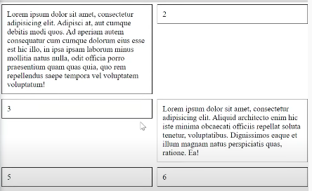
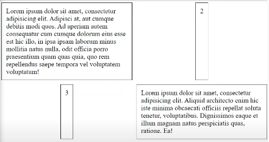
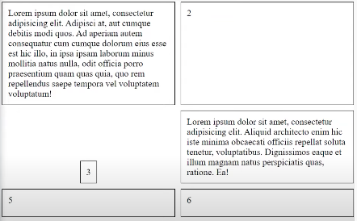

# CSS Grid
> Система построения двухмерных сеток(по двумя осям)

Для того что бы начать работать с системой grid достаточно указать блоку 
```css
.container {
    display: grid;
}
```
Но визуально это ничего не изменит, пока мы не опишем шаблон специальными свойствами `grid-template-colums` и `grid-template-rows`

## Общие правила

💠 **Единицы измерения**   
👆🏽 css-grid правила, поддерживают все единицы измерения, и имеют свою особенную

<br>

&emsp;&emsp; 🎯 Пиксели       

&emsp;&emsp; 🎯 Вьпорты

&emsp;&emsp; 🎯 Проценты

&emsp;&emsp; 🎯 `Фракции`  
&emsp;&emsp;&emsp;&emsp; 👆 Это какая-то часть от ширины контейнера

<br>
<br>

💠 **repeat`(count, size)`**   
👆🏽 Указывает сколько раз повторить какой-либо размер

```css
.container {
    display: grid;
    grid-template-columns: repeat(10, 100px);
}
```
👆 Создаст в `grid-template-columns` 10 колонок по `100px`   

<br>
<br>

💠 **minmax`(size)`**   
👆🏽 Метод который можно использовать для указания минимального и максимального размера колонки или строки

<br>

&emsp;&emsp; 🔹 Можно использовать в любом grid правиле, описывающее размерность

```css
.container {
    display: grid;
    grid-template-columns: repeat(10, 100px);
    grid-auto-rows: minmax(100px, 200px);
}
```

<br>
<br>

## Размеры всех элементов сетки

💠 **`grid-template-colums`**   
👆🏽 Правило описывающие кол-во колонок в контейнере и их размеры

```css
.container {
    display: grid;
    grid-template-columns: 150px 100px 150px;
}
```
👆 создаст блок с тремя строчками указанных размеров    

<br>
<br>

💠 **`grid-template-rows`**   
👆🏽 Правило описывающие высоту строк

```css
.container {
    display: grid;
    grid-template-colums: 1fr 1fr;
    grid-template-rows: 150px 100px 150px;
}
```
👆 Укажет размер каждой из строк сетки

<br>
<br>

💠 **`grid-auto-rows`**   
👆🏽 Правило описывающие высоту строк, у которых он явно не задан

```css
.container {
    display: grid;
    grid-template-colums: 1fr 1fr;
    grid-template-rows: 150px;
    grid-auto-rows: 200px;
}
```
👆 Первая строка будер высотой `150px`, все остальные по `200px`

## Отступы между колонками и строками

❗ Правила для отступов поддерживают любые единицы измерения

💠 **`grid-column-gap`**   
👆🏽 Правило описывающие отступы между колонками по оси x

<br> 

```css
.container {
    display: grid;
    grid-template-columns: 150px 150px 150px;
    grid-column-gap: 10px;
}
```
👆 Задаст отступы между колонками по оси x по `10px`

<br>
<br>

💠 **`grid-row-gap`**   
👆🏽 Правило описывающие отступы между строками по оси y

```css
.container {
    display: grid;
    grid-template-columns: 150px 150px 150px;
    grid-row-gap: 10px;
}
```
👆 Задаст отступы между строками по оси y по `10px`

<br>
<br>

💠 **`grid-gap`**   
👆🏽 Правило описывающие отступы между строками и колонками в одном свойстве

```css
.container {
    display: grid;
    grid-template-columns: 150px 150px 150px;
    grid-gap: 10px;
}
```
👆 Задаст отступы между строками и колонками по `10px`

<br>
<br>

## Выравнивание всех элементов

💠 **justify-content**   
👆🏽 Выравнивание всех элементов контейнера по оси x

<br>

&emsp;&emsp; 🎯 start     

&emsp;&emsp; 🎯 center  

&emsp;&emsp; 🎯 end

<br>
<br>

💠 **align-content**   
👆🏽 Выравнивание всех элементов контейнера по оси y

<br>

&emsp;&emsp; 🎯 start

&emsp;&emsp; 🎯 center

&emsp;&emsp; 🎯 end

<br>
<br>

💠 **align-items**   
👆🏽 Выравнивание колонок, относительно их строки(как у flex)

<p align="center" style="text-align:center">
    
</p>

<br>

&emsp;&emsp; 🎯 start

&emsp;&emsp; 🎯 center

&emsp;&emsp; 🎯 stretch

&emsp;&emsp; 🎯 end

<br>
<br>

💠 **justify-items**   
👆🏽 Выравнивание контента колонки, относительно самой колонки по оси x

<p align="center" style="text-align:center">
    
</p>

<br>

&emsp;&emsp; 🎯 start

&emsp;&emsp; 🎯 center

&emsp;&emsp; 🎯 stretch

&emsp;&emsp; 🎯 end

<br>
<br>

## Выравнивание одной ячейки

<p align="center" style="text-align:center">
    
</p>

Принцип как и для всех ячеек, только работа производиться над конкретоной ячейкой

&emsp;&emsp; 🔹 `align-self`    

&emsp;&emsp; 🔹 `justify-self`

<a href="https://cssgridgarden.com/#ru">Игра для наработки флексов</a>

## Позиция элемента

❗ При указани позиции нужно считать на + 1 еденицу   
т.е в двух колоночной таблице что бы указать элементу размер в две строки будет следующие правила
```css
.item {
    grid-column-start: 1;
    grid-column-end: 3;
}
```

💠 **`grid-column-star`**   
👆🏽 Укажет на какой колонке должен находиться элемент

<br>

💠 **`grid-column-end`**   
👆🏽 Укажет до какой колонки растянуть элемент

```css
.item {
    grid-column-start: 1;
    grid-column-end: 3;
}
```

💠 **`grid-column`**
👆🏽 Скращенная запись `grid-column-(start/end)` 
```css
.item {
    grid-column: 1/3;
}
```

<br>
<br>

💠 **`grid-row-star`**   
👆🏽 Укажет на какой строке должен находиться элемент

<br>

💠 **`grid-row-end`**   
👆🏽 Укажет до какой строке растянуть элемент

```css
.item {
    grid-row-start: 1;
    grid-row-end: 3;
}
```

💠 **`grid-column`**
👆🏽 Скращенная запись `grid-column-(start/end)`
```css
.item {
    grid-row: 1/3;
}
```

## Описание сетки сущностями

Позволяет указывать имена сущностей, и сколько колонок эта сущность будет занимать

```css
.container {
    display: grid;
    grid-template-areas:
            'header header'
            'sidebar content';
    grid-gap: 10px;
}

.header {
    grid-area: header;
}

.sidebar {
    grid-area: sidebar;
}

.content {
    grid-area: content;
}
```
👆 Из максимального кол-ва элементов в строке `grid-template-areas`, видно что в сетке две строки  
Далее укзазано что header занимает две строки