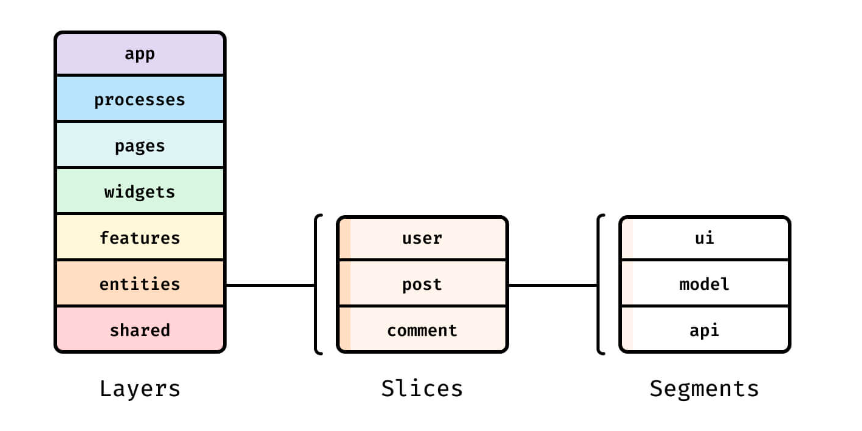

# Feature Sliced
> Архитектура раздробленная на более мелкие и конкретные слои ответственности

💠 Будет лишней в следующих ситуациях

&emsp;&emsp; 🔹 Короткоживущие, мелкие проекты            

&emsp;&emsp; 🔹 Один разработчик

&emsp;&emsp; 🔹 Горящие сроки для стартапа

 

💠 Сложности

&emsp;&emsp; 🔹 Более сложный порог вхождения

&emsp;&emsp; 🔹 Сложности проектирования архитектуры заходят влоб прямо `сейчас`  
&emsp;&emsp;&emsp;&emsp; 👆 А не потом когда на середине проекта понимаешь что проект превращаеться в свалку   

&emsp;&emsp; 🔹 Подключение новых членов команды   

 

💠 Плюсы

&emsp;&emsp; 🔹 Проект не превращаеться в свалку при постоянном росте и развитии 

&emsp;&emsp; 🔹 Все(`Разработчики/PM/Тестеры`) говорят примерно на одном языке

&emsp;&emsp; 🔹 Всем понятно где искать какие элементы 

&emsp;&emsp; 🔹 При конкретно поставленной задаче, понятно в какой слой нужно идти что бы ее править

## 🚩 Слои Feature Sliced

💠 `shared`   
👆🏽 Элементы ничего не знающие о предметной области, доступный всем идущим выше слоям

> 📗 Папку `shared` можно таскать из проекта в проект

&emsp;&emsp; 🔹 `global ui kit`        
&emsp;&emsp; 🔹 `helpers/widgets`  
&emsp;&emsp; 🔹 `api`  
&emsp;&emsp; 🔹 `constants`  
&emsp;&emsp; 🔹 `config`

 

💠 `entities`   
👆🏽 Бизнес сущности, собранные из `shared` кусков, например карточка товара 

&emsp;&emsp; 🔹         
&emsp;&emsp; 🔹 `helpers/widgets`  
&emsp;&emsp; 🔹 `api`  
&emsp;&emsp; 🔹 `constants`  
&emsp;&emsp; 🔹 `config`

 

💠 `entities`   
👆🏽 Бизнес сущности, собранные из `shared` кусков, например карточка товара

&emsp;&emsp; 🔹         
&emsp;&emsp; 🔹 `helpers/widgets`  
&emsp;&emsp; 🔹 `api`  
&emsp;&emsp; 🔹 `constants`  
&emsp;&emsp; 🔹 `config`

 

💠 `features`   
👆🏽 Сущности покрывающие юскейсы

&emsp;&emsp; 🔹 `Кнопка добавить в избранное`        
&emsp;&emsp; 🔹 `Форма оплаты`

 

💠 `widgets`   
👆🏽 Самостоятельные блоки комбинирующие нижние слои

&emsp;&emsp; 🔹 `Хедр`  
&emsp;&emsp; 🔹 `Футер`  
&emsp;&emsp; 🔹 `какой-то повторяющийся список товаров с лоадером`

 

💠 `pages`   
👆🏽 Отдельные странички, в которых реализуеться компановка ниже лежащих слоев

 

💠 `processes`   
👆🏽 Процессы, повторяющися на нескольких страничках

&emsp;&emsp; 🔹 Регистрация        
&emsp;&emsp; 🔹 Оплата товара

 

💠 `app`   
👆🏽 Инициализация логики приложения

&emsp;&emsp; 🔹 Поключения глобальных стилей  
&emsp;&emsp; 🔹 Роутер  
&emsp;&emsp; 🔹 Обетка шаблоном

 

## 🚩 Slice
👆🏽 Часть, лежащая в любом слое, отвечающая за отдельную область  
&emsp;&emsp; 👆 `user` в слое `page` это `slice`   

## 🚩 Сегмент
👆🏽 Дроблениме слайса

&emsp;&emsp; 🔹 `ui`  

&emsp;&emsp;&emsp;&emsp; 🎯 `components`   
&emsp;&emsp;&emsp;&emsp; 🎯 `widgets`   
&emsp;&emsp;&emsp;&emsp; 🎯 `canvas` 

&emsp;&emsp; 🔹 `lib`   
&emsp;&emsp;&emsp;&emsp; 👆 Вспомогательные библиотеки    

&emsp;&emsp; 🔹 `api`   
&emsp;&emsp;&emsp;&emsp; 👆 Логика взаимодействия с API

&emsp;&emsp; 🔹 `config`   
&emsp;&emsp;&emsp;&emsp; 👆 модуль конфигурации приложения и его окружения

📗  **<a href="https://feature-sliced.design/docs/reference">Оффициальная документация</a>**

### ⟵ **<a href="../../readme.md">Назад</a>**