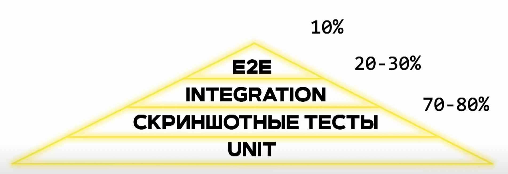

# Автоматическое тестирование
Инструмент обеспечивающий бесперебойную работу существующего функционала, при внедрение изменений

💠 Unit Тесты  
👆🏽 Тесты проверяющие работоспособность <ins>[отдельного модуля 💬](## "Хелперов, хуков, HOF, UI")</ins> в изолируемом пространстве от других модулей    

&emsp;&emsp; 🔹 Проверяет что при получении ожидаемых валидных данных приходит ожидаемый валидный результат    
&emsp;&emsp; 🔹 Проверяет результат работы при невалидных данных  
&emsp;&emsp; 🔹 Должны покрывать большую часть кода

 

💠 Integration Тесты  
👆🏽 Тесты проверяющие <ins>[взаимодействие между отдельными модулями 💬](## "App с redux, pages с Router, Api с reactQuery")</ins>

&emsp;&emsp; 🔹 Пытаеться максимально воспроизвести среду пользователя    
&emsp;&emsp; 🔹 Объединяет несколько протестированных по отдельности модуля  
&emsp;&emsp; 🔹 Проверяет валидность их работы  

 

💠 E2E Тесты  
👆🏽 Тесты в реальном браузере, выполняющие реальные действия пользователя

&emsp;&emsp; 🔹 Самые сложные, и времязатратные    
&emsp;&emsp; 🔹 Должны покрывать только тот функционал, без которого сайт бесполезен

 

💠 Визуальные тесты  
👆🏽 Тесты проверяющие визуальное изменение верстки

&emsp;&emsp; 🔹 Делает скриншоты верстки на разных устройствах   
&emsp;&emsp; 🔹 При любых изменениях путем наложения сравнивает новые скрины с предыдущими  
&emsp;&emsp; 🔹 Подсвечивает все места где поплыла верстка

 

### ⟵ **<a href="../../readme.md">Назад</a>**