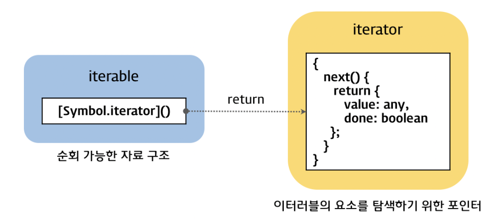

# Итератор

👆🏽 Это объект, содержащий в пропсах или в прототипе метод `next()`, который позволяет возвращать свойства объекта последовательно

<br>

<details>
<summary> 💠 Структура синхронного итератора</summary>


🔹 Должен содержать внутри объекта свойства:   
&emsp;&emsp; 🎯 `from`       
&emsp;&emsp; 🎯 `to`

🔹 Сама функция итератор, должна лежать в свойстве `[Symbol.iterator]`     
&emsp;&emsp; 👆 Так как <ins>[все конструкции языка 💬](## "for|map|...")</ins> будут искать итератор под этим ключем

🔹 Итератор должен хранить в замыкании текущий шаг перебора

🔹 Итератор должен возвращать объект с методом `next()`      
&emsp;&emsp; 👆 Который работает с шагом объекта

🔹 Метод `next()`, должен возвращать объект с свойствами  
&emsp;&emsp; 🎯 `done`(`true/false`) - Все свойства были перебраные   
&emsp;&emsp; 🎯 `value` - Итерируемое свойство           
&emsp;&emsp;&emsp;&emsp; 👆 После того как все свойства перебранны, возвращает `{done: true, value: undefined}`

🔹 `[Symbol.iterator]() => {}` - метод, позволяющий сделать из объекта итератор

<details>
<summary>  Структура итерируемого объекта</summary>

----

```javascript
let range = {
  from: 1,
  to: 5
}

// сделаем объект range итерируемым
range[Symbol.iterator] = function() {

  let current = this.from;
  let last = this.to;

  // метод должен вернуть объект с методом next()
  return {
    next() {
      if (current <= last) {
        return {
          done: false,
          value: current++
        };
      } else {
        return {
          done: true
        };
      }
    }

  }
};

for (let num of range) {
  console.log(num); // 1, затем 2, 3, 4, 5
}
```

----

</details>

<details>
<summary>  Структура итерируемого массива</summary>

----

```javascript
let range = {
  0: '1',
  1: '2',
  2: '3',
  length: 3  
}

// сделаем объект range итерируемым
range[Symbol.iterator] = function() {

  let current = 0;
  let last = this.length;

  // метод должен вернуть объект с методом next()
  return {
    next() {
      if (current <= last) {
          
        const result = {
            done: false,
            value: range[current]
        }; 
        current++
        return result
      } else {
        return {
          done: true
        };
      }
    }

  }
};

for (let num of range) {
  console.log(num); // 1, затем 2, 3
}
```

----

</details>


</details>


<br>

<details>
<summary> 💠 Структура ассинхронного итератора</summary>


🔹 Функция итератор должна лежать в `[Symbol.asyncIterator]` свойстве объекта

🔹 Метод `next()` должен возвращать промис

🔹 Ассинхронный итератор можно перебирать с помощью `for await(item of iterator)`

🛑 С ассинхронным итератором, не работают <ins>[синхронный операции итератора 💬](## "for of без await")</ins>  
  
<details>
<summary>  Ассинхронный итератор </summary>

----

```javascript
let range = {
  from: 1,
  to: 5,

  [Symbol.asyncIterator]() {
    

    return {
      current: this.from,
      last: this.to,

      // должен возвращать значение как объект {done:.., value :...}
      // (автоматически оборачивается в промис с помощью async)
      async next() { // (2)
        
        // можно использовать await внутри для асинхронности:
        await new Promise(resolve => setTimeout(resolve, 1000)); // (3)

        if (this.current <= this.last) {
          return { done: false, value: this.current++ };
        } else {
          return { done: true };
        }
      }
    };
  }
};

(async() => {

  for await (let item of range) {
    console.log(item) // 1, 2, 3, 4, 5(с таймаутом в секунду)
  }

})()


console.log( [...range] ); // Ошибка, нет Symbol.iterator
```             

----

</details>


</details>

<br>

### ⟵ **<a href="../../readme.md">Назад</a>**    
