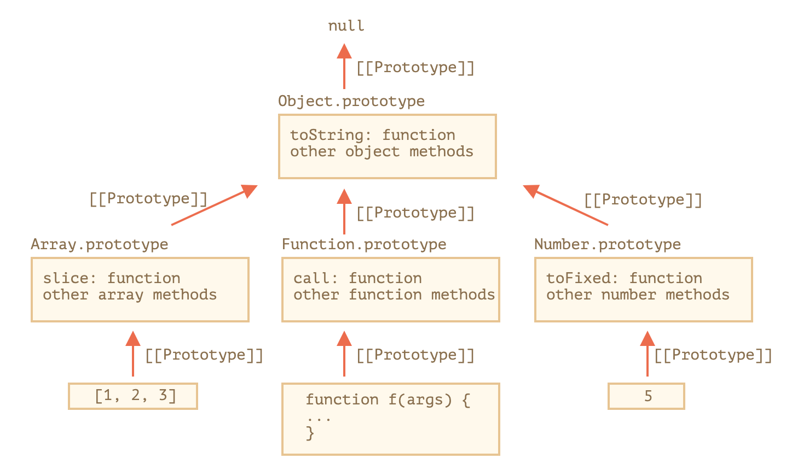

<p align="center" style="text-align:center">
      
</p>

# Встроенные прототипы
> Объекты содержащие методы различных типов данных в js

🎯 В JS, хоть и не явно, но почти все типы данных вызываются при помощи функций конструкторов

&emsp;&emsp; 👆 `{name: 'Ben'}` --> `new Object({name: 'Ben'})`    

&emsp;&emsp; 👆 `[1, 2, 3]` --> `new Array(1, 2, 3)`


🎯 Во время создания данных через конструктор, к ним привязываются данные из прототипа  

🎯 Благодаря этому почти у всех данных есть свой набор методов   
&emsp;&emsp; 👆 Они хранятся в прототипе

🔹 Примитивы `(number, string, boolean)` оборачивается во временный объект обертку        
&emsp;&emsp; 👆 Благодаря временной обертке и ее прототипу, даже у примитивов есть доступ к своим методам

🔹 `(null, undefined)` Не имеют временной обертки

🔹 Встроенные прототипы потдаются расширению  
&emsp;&emsp; 👆 Не явный вызов данных через `new`, позволяет помещать дополнительные методы в `prototype`, глобальных объектов
```javascript
String.prototype.upperCaseFirstLater = function () {
  const firstUpperLetter = this[0].toUpperCase(),
    lettersAfterFirst = this.slice(1);

  return `${firstUpperLetter}${lettersAfterFirst}`;
};

console.log("abc".upperCaseFirstLater());
```   

🔹 Методы глобальных объектов можно отдалживать
```javascript
let obj = {
  0: "Hello",
  1: "world!",
  length: 2,
};

obj.join = Array.prototype.join;

alert( obj.join(',') ); // Hello,world!
```

🛑 Создавать дополнительные методы в глобальных объектах стоит только для полиффилов  
&emsp;&emsp;&emsp;&emsp; 👆 Обьекты глобальны, и возможны конфликты

<br>

### ⟵ **<a href="../../readme.md">Назад</a>**   