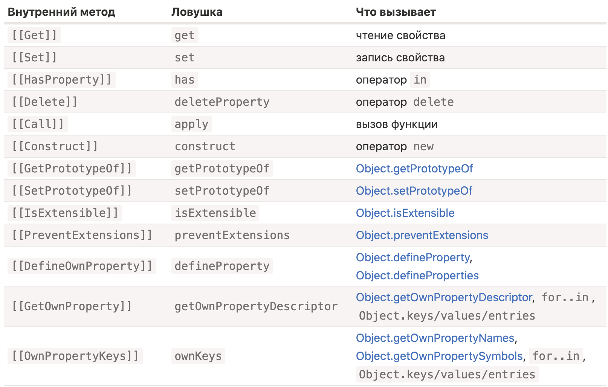

# Proxy
> Объект обертка, позволяющая перехватывать различные операции над обернутым объектом

```javascript
let proxy = new Proxy(target, handler);
```

🔹 `target` - объект для которого будет сделано прокси

🔹 `handler` - объект с ловушками на различные операции  
&emsp;&emsp; 👆 Например `get/set`

🔹 Проксировать можно любой объект, включая массивы, классы и функции

🔹 Прокси и объект, который проксируется, являются двумя разными объектами  
&emsp;&emsp; 👆 Но при изменениях прокси либо оригинального объекта, изменение произойдет в обоих

🔹 Ловушки сработают только при выполнении операций через прокси объект

🔹 Без ловушек `proxy` является прозрачной обёрткой просто перенаправляющий все операции на `target`

🔹 Никто не должен ссылаться на оригинальный объект после того, как он был проксирован `(Иначе очень легко запутаться)`    
&emsp;&emsp; 👆 Для этого стоит перезаписать переменную оригинального объекта, объектом прокси

```javascript
let numbers = [0, 1, 2];

numbers = new Proxy(numbers, {})
```

🔹 `proxy` может перехватывать и изменять работу так называемых "внутренних методов"  
&emsp;&emsp; 👆 Для каждого внутреннего метода есть свое название ловушки

<p align="center" style="text-align:center">
      
</p>

<br>

💠 **Ловушка `get(target, property, receiver)`**   
👆🏽 Позволяет расширить функционал получения свойств  

&emsp;&emsp; 🔹 Добавить значение по умолчанию

&emsp;&emsp; 🔹 Закрыть доступ для чтения скрытых свойств

&emsp;&emsp; 🎯 `target` - Оригинальный объект

&emsp;&emsp; 🎯 `property` - Имя читаемого свойства

&emsp;&emsp; 🎯 `receiver` - Контекст

```javascript
let dictionary = {
    'Hello': 'Hola',
    'Bye': 'Adiós'
};

dictionary = new Proxy(dictionary, {
    get(target, phrase) {           // перехватываем чтение свойства в dictionary
        if (phrase in target) {     // если перевод для фразы есть в словаре
            return target[phrase];  // возвращаем его
        } else {
                                    // иначе возвращаем непереведённую фразу
            return phrase;
        }
    }
});

console.log(dictionary['Hello']);            // 👉🏼 Hola
console.log(dictionary['Welcome to Proxy']); // 👉🏼 Welcome to Proxy (нет перевода)
```

<br><br>

💠 **Ловушка `set(target, property, value, receiver)`**   
👆🏽 Позволяет контролировать вводимые значения

&emsp;&emsp; 🔹 Валидировать

&emsp;&emsp; 🔹 Модифицировать на лету

&emsp;&emsp; 🔹 Блокировать запись или изменение свойств

&emsp;&emsp; 🛑 Ловушка `set`, должна возвращать `true`, для успешной записи

&emsp;&emsp; 🛑 Если ловушка `set` вернула `false`, будет выброшенна ошибка    
&emsp;&emsp; 👆 если ошибку не обернуть в `try/catch`, она положет весь скрипт

&emsp;&emsp; 🎯 `target` - Оригинальный объект  
&emsp;&emsp; 🎯 `property` - Имя читаемого свойства  
&emsp;&emsp; 🎯 `value` – значение свойства  
&emsp;&emsp; 🎯 `receiver` - Контекст

<br><br>

💠 **Ловушка `set(target, property, value, receiver)`**   
👆🏽 Позволяет контролировать вводимые значения

```javascript
let numbers = [];

numbers = new Proxy(numbers, { // (*)
    set(target, prop, val) { // для перехвата записи свойства
        if (typeof val == 'number') {
            target[prop] = val;
            return true;
        } else {
            return false;
        }
    }
});

numbers.push(1);
numbers.push(2);
console.log(numbers) // [1, 2]

numbers.push("тест"); // TypeError (ловушка set на прокси вернула false)
```

<br><br>

💠 **Ловушка `ownKeys(target)`**   
👆🏽 Позволяет контролировать работу с списком свойств объекта

&emsp;&emsp; 🔹 Исключать ключи из циклов

&emsp;&emsp; 🛑 Ловушка `ownKeys`, должна возвращать массив ключей, которые будут доступны для перебора

&emsp;&emsp; 🎯 `target` - Оригинальный объект

```javascript
let user = {
    name: "Alex",
    age: 25,
    _password: "***"
};

user = new Proxy(user, {
    ownKeys(target) {
        return Object.keys(target).filter(key => !key.startsWith('_'));
    }
});

for(let key in user) console.log(key); // 👉🏼 name, age

console.log( Object.keys(user) );      // 👉🏼 name, age
console.log( Object.values(user) );    // 👉🏼 Вася, 30
console.log( Object.entries(user) );   // 👉🏼 [ [ 'name', 'Alex' ], [ 'age', 25 ] ]
```

<br><br>

💠 **Ловушка `getOwnPropertyDescriptor(target, prop)`**   
👆🏽 Позволяет перехватывать момент проверки дескрипторов

&emsp;&emsp; 🎯 `target` - Оригинальный объект  
&emsp;&emsp; 🎯 `prop` - Проверяемое свойтсво

📗 Многие итерируемые методы(`например Object.keys`) возвращают только свойства с дескриптором `enumerable: true`

&emsp;&emsp; 🔹 Для определения дескриптора, у каждого свойтсва вызываеться внутренний метод `[[GetOwnProperty]]`  
&emsp;&emsp; 🔹 ловушка `getOwnPropertyDescriptor` позволяет перехватить обращение к этому методу, и вернуть нужные дескрипторы

```javascript
let user = { };

user = new Proxy(user, {
    ownKeys(target) {                        // 👉🏼 вызывается 1 раз для получения списка свойств
        return ['a', 'b', 'c'];
    },
    getOwnPropertyDescriptor(target, prop) { // 👉🏼 вызывается для каждого свойства
        return {
            enumerable: true,
            configurable: true
        };
    }

});

console.log( Object.keys(user) ); // 👉🏼 a, b, c
```

<br><br>

💠 **Ловушка `deleteProperty(target, prop)`**   
👆🏽 Позволяет перехватывать удаление свойства

&emsp;&emsp; 🎯 `target` - Оригинальный объект  
&emsp;&emsp; 🎯 `prop` - Удаляемое свойтсво

```javascript
let user = {
  name: "Вася",
  _password: "***"
};

user = new Proxy(user, {
    deleteProperty(target, prop) {
        if (prop.startsWith('_')) {
            throw new Error("Отказано в доступе");
        }
        
        delete target[prop];
        return true;
    }
});

try {
    delete user._password;
} catch(e) { 
    console.log(e.message); // 👉🏼 Error: Отказано в доступе
}
```

<br><br>

💠 **Ловушка `has(target, prop)`**   
👆🏽 Позволяет перехватывать проверку свойства в объекте

&emsp;&emsp; 🎯 `target` - Оригинальный объект  
&emsp;&emsp; 🎯 `prop` - Проверяемое свойтсво


```javascript
let user = { name: undefined, age: null};

user = new Proxy(user, {
    has(target, prop) {
        if (prop in target && typeof target[prop] !== 'undefined') {
            return true
        }

        return false
    }
});

console.log( 'name' in user ); // 👉🏼 false
console.log( 'age' in user );  // 👉🏼 true
```

<br><br>

💠 **Ловушка `apply(target, thisArg, args)`**   
👆🏽 Позволяет перехватывать вызов функции

&emsp;&emsp; 🎯 `target` - Оригинальный объект (`в данном случаи оригинальная функция`)    
&emsp;&emsp; 🎯 `thisArg` - Контекст функции  
&emsp;&emsp; 🎯 `args` - Аргументы функции  

🛑 В отличии от обычной обертки, `Proxy` перенаправляет чтения свойств `name` и `length` на оригинальную функцию, которую оборачивают  

```javascript
function delay(f, ms) {
    return new Proxy(f, {
        apply(target, thisArg, args) {
            setTimeout(() => target.apply(thisArg, args), ms);
        }
    });
}

function sayHi(user) {
    console.log(`Привет, ${user}!`);
}

sayHi = delay(sayHi, 3000);

console.log(sayHi.length); // 👉🏼 прокси перенаправляет чтение свойства length на исходную функцию
```

<br>

## Отключаемый прокси  
👆 Прокси, который может быть отключен вызовом специальной функции

```javascript
let object = {
    data: "Важные данные"
};

let {proxy, revoke} = Proxy.revocable(object, {
    get(target, prop) {
        const value = target[prop]
        return typeof value === 'string' ? value.toUpperCase() : value
    }
});

console.log(proxy.data) // 👉🏼 'ВАЖНЫЕ ДАННЫЕ'

revoke()                // Выключит прокси

console.log(object.data) // 👉🏼 'Важные данные' 🛑 Доступ к оригинальному объекту остаеться 
console.log(proxy.data)  // 👉🏼 TypeError: Cannot perform 'get' on a proxy that has been revoked
```

<br><br>

### ⟵ **<a href="../../readme.md">Назад</a>**  

[comment]: <> (✍🏼 Приватные поля, Map, Set, constuct)