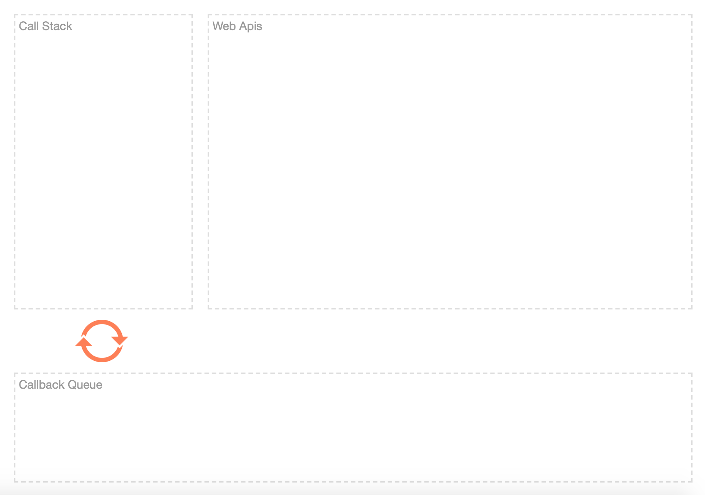
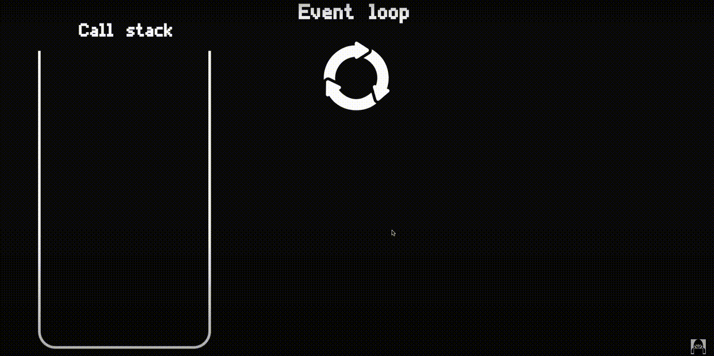
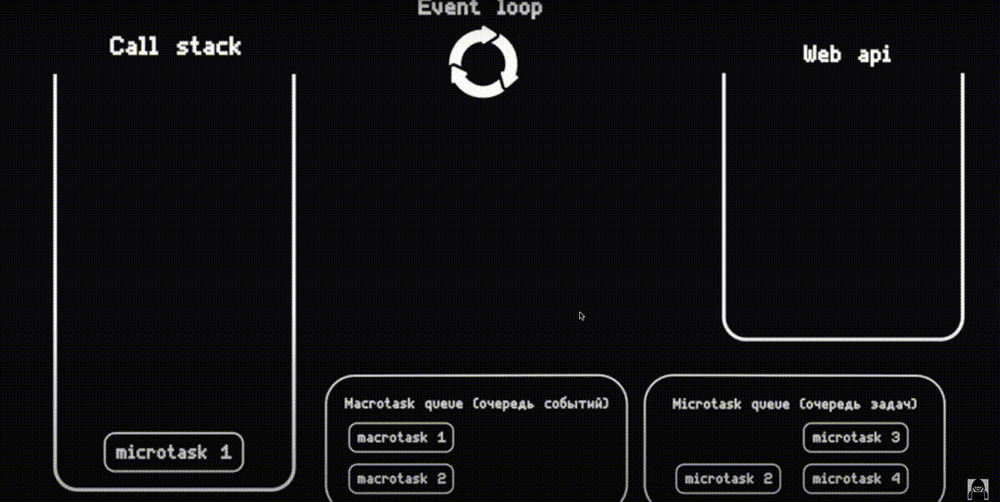

<a href="http://latentflip.com/loupe/?code=JC5vbignYnV0dG9uJywgJ2NsaWNrJywgZnVuY3Rpb24gb25DbGljaygpIHsKICAgIHNldFRpbWVvdXQoZnVuY3Rpb24gdGltZXIoKSB7CiAgICAgICAgY29uc29sZS5sb2coJ1lvdSBjbGlja2VkIHRoZSBidXR0b24hJyk7ICAgIAogICAgfSwgMjAwMCk7Cn0pOwoKY29uc29sZS5sb2coIkhpISIpOwoKc2V0VGltZW91dChmdW5jdGlvbiB0aW1lb3V0KCkgewogICAgY29uc29sZS5sb2coIkNsaWNrIHRoZSBidXR0b24hIik7Cn0sIDUwMDApOwoKY29uc29sZS5sb2coIldlbGNvbWUgdG8gbG91cGUuIik7!!!PGJ1dHRvbj5DbGljayBtZSE8L2J1dHRvbj4%3D">
  <p align="center" style="text-align:center">
      
  </p>
</a>

<details>
<summary> 🔥 <code>Shortcut</code></summary>

___

&emsp;&emsp; 🔹 Макро таски  
&emsp;&emsp;&emsp;&emsp; 🎯 Таймеры  
&emsp;&emsp;&emsp;&emsp; 🎯 <ins>[События](## "Клик, input/output")</ins>  
&emsp;&emsp;&emsp;&emsp; 🎯 Загрузка изображений

<br>

&emsp;&emsp; 🔹 Микро таски  
&emsp;&emsp;&emsp;&emsp; 🎯 Promise  
&emsp;&emsp;&emsp;&emsp; 🎯 <ins>[queueMicrotask](## "Искуственная созданная микротаска")</ins>  
&emsp;&emsp;&emsp;&emsp; 🎯 <a href="https://learn.javascript.ru/mutation-observer">mutationObserver</a>

<br>

&emsp;&emsp; ❗ Порядок выполнения  
&emsp;&emsp;&emsp;&emsp; 🎯 1.Стек  
&emsp;&emsp;&emsp;&emsp; 🎯 2.Все микротаски     
&emsp;&emsp;&emsp;&emsp; 🎯 3.Макро таска  
&emsp;&emsp;&emsp;&emsp; 🛑 4.Если Макро таска порождает <ins>[микро таску](## "Например промис")</ins>, `eventLoop` сначала выполненнит новую микро таску, а только после приступит к следующей макро таске

___

</details>

# Event loop
👆🏽 Отдельный от `JS` механизм позволящий не блокировать поток при вызове ассинхронных задач  

<details>
<summary>📗 Потоки в JS</summary>

___

&emsp;&emsp; 🎯  JavaScript - однопоточный язык программирования  
&emsp;&emsp;&emsp;&emsp; 👆 Выполняет задачи одну за другой в порядке очереди 

&emsp;&emsp; 🎯 Если в коде попалась сложная операция, код после не выполнится, пока сложная операция не будет выполнена    

&emsp;&emsp; 🎯 Зная логику работы событийныного цикла, можно построить код так, что бы ресурсоемкие операции, не блокировали поток, и интерфейс пользователя    

___

</details>

<br>

💠 **Call stack**  
👆🏽 Хранилище, куда помещаються функции которые будут сейчас выполняться, или зарегистрироанны в очередь

&emsp;&emsp; 🔹 Порядок выполнения последний вошел, первый вышел  

<details>
<summary>📗 Порядок выполнения</summary>

___

&emsp;&emsp; 🎯 Функция попадает в стек  
&emsp;&emsp;&emsp;&emsp; 👆 Пока функция не отработает, следующие функции не читаються  

&emsp;&emsp; 🎯 Все функции внутри той что в стеке, добавляються поочередно наверх в стек       
&emsp;&emsp; 🎯 После этого функции в стеке начинают выполняться с конца   
&emsp;&emsp; 🛑 Ассинхронные функции, не блокируют поток выполнения остальных функций  
&emsp;&emsp;&emsp;&emsp; 👆 Они просто регистрируються, и перемещаються в `web api`



___

</details>


&emsp;&emsp; 🛑 Стек ограничен количистве функций  
&emsp;&emsp;&emsp;&emsp; 👆 При переполнения стека - сайт крашиться  

<br>  
<br>


💠 <a name="web-api">**WebApi**</a>  
👆🏽 Хранилище, куда помещаються ассинхронные задачи относящиеся к `WebApi`, которые будут выполнены только после выполнения всех задач из `CallStack` 

&emsp;&emsp; 🔹 Порядок выполнения первый вышел, первый вышел

<details>
<summary>📗 Порядок выполнения</summary>

___

&emsp;&emsp; 🎯 Ассинхронная функция попадает в стек  
&emsp;&emsp; 🎯 Поток не блокируеться   
&emsp;&emsp;&emsp;&emsp; 👆 Мы не ждем пока она выполниться, а сразу переходим к след функции  

&emsp;&emsp; 🎯 Ассинхронная функция отправляеться в очередь `web api`

&emsp;&emsp; 🎯 После клика, или прошедшого таймаута, функции переходяд из `web api` в **<a href="#task-queve">очередь задач</a>**

&emsp;&emsp; 🎯 После того как все функции из `call stack` выполнены, `event-loop` начинает выполнять по одной задаче в порядке их объявления, отправляя их в `call stack`


___

</details>

<br>  
<br>


💠 **<a name="task-queve">Очередь задач</a>**  
👆🏽 Очередь ассинхронных функций, которые деляться на два вида

&emsp;&emsp; 🔹 Макро таски  
&emsp;&emsp;&emsp;&emsp; 🎯 Таймеры  
&emsp;&emsp;&emsp;&emsp; 🎯 <ins>[События](## "Клик, input/output")</ins>  
&emsp;&emsp;&emsp;&emsp; 🎯 Загрузка изображений

<br>

&emsp;&emsp; 🔹 Микро таски  
&emsp;&emsp;&emsp;&emsp; 🎯 Promise  
&emsp;&emsp;&emsp;&emsp; 🎯 <ins>[queueMicrotask](## "Искуственная созданная микротаска")</ins>  
&emsp;&emsp;&emsp;&emsp; 🎯 <a href="https://learn.javascript.ru/mutation-observer">mutationObserver</a>

<br>

&emsp;&emsp; ❗ Порядок выполнения  
&emsp;&emsp;&emsp;&emsp; 🎯 1.Все микротаски     
&emsp;&emsp;&emsp;&emsp; 🎯 2.Макро таска  
&emsp;&emsp;&emsp;&emsp; 🛑 3.Если Макро таска порождает <ins>[микро таску](## "Например промис")</ins>, `eventLoop` сначала выполненнит новую микро таску, а только после приступит к следующей макро таске



#### Задачка на понимание event Loop

Какой будет порядок вывода?

```javascript
console.log('first');

setTimeout(() => {
   console.log('inside timeout')
}, 0)

Promise.resolve().then(() => {
    console.log('second')
})

const a = new Promise((resolve, reject) => resolve(console.log('third')))

a.then(() => {
    console.log('fifth')
})

console.log('fourth')
```

<details>
<summary> ✅ Ответ</summary>

___

1. first
2. third
3. fourth
4. second
5. fifth
6. inside timeout

Хоть **inside timeout** написан первым и таймаут стоит 0,   
Он все равно попадает в webApi, потом в очередь в макротаски, и отработает только после того  
Как синхронный код будет выполнен

Промис и таймаут попадают в одну и ту же очередь, но несмотря на то что таймаут написан раньше, промис отработает первым, так как промис это микро таска

Не смотря на то что `console.log('third')` лежит в промисе, лог резолвиться сразу, без then или await, и такой код будет считаться синхронным

___

</details>

<br>

### ⟵ **<a href="../../readme.md">Назад</a>**

