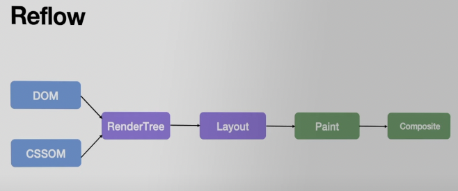

# Rendering



<details>
<summary>📚 lessons</summary>

___    

<a href="https://www.youtube.com/watch?v=QDQSj4__v_8">Render process</a>  
<a href="https://www.youtube.com/watch?v=DZynQ-QYSJU">Performance</a>  
<a href="https://www.youtube.com/watch?v=tFjDuHeDLmo">Layout trashing task</a>
___

</details>

💠 Процесс перерисовки  

&emsp;&emsp; 🔹 RenderTree  
&emsp;&emsp;&emsp;&emsp; 👆 Процесс перерисовки `DOM`, для добавления или удаления элемента  
&emsp;&emsp;&emsp;&emsp;&emsp;&emsp; 🔸 Самый дорогой   

<br>

&emsp;&emsp; 🔹 Layout  
&emsp;&emsp;&emsp;&emsp; 👆 Процесс отрисовки геометрии <sup><sub>( размеры, расположение )</sub></sup>  
&emsp;&emsp;&emsp;&emsp;&emsp;&emsp; 🔸 При изменении геометрии вызывает `Relayout` у элементов лежащих на одном слое 


<br>

&emsp;&emsp; 🔹 Paint  
&emsp;&emsp;&emsp;&emsp; 👆 Почти самый дешевый метод изменяющий только внешний вид <sup><sub>( цвет, тень )</sub></sup>

<br>

&emsp;&emsp; 🔹 Composite  
&emsp;&emsp;&emsp;&emsp; 👆 Процесс композиции слоев  
&emsp;&emsp;&emsp;&emsp;&emsp;&emsp; 🎯 Работает на видео карте  
&emsp;&emsp;&emsp;&emsp;&emsp;&emsp; 🎯 Не пересчитывает соседние элементы при трансформациях

<br>  
<br>

💠 Правила плавной анимации   

&emsp;&emsp; 🔹 Анимируем на отдельном слое что бы не затрагивать слои соседних компонентов, при помощи willChange, или `transzateZ || translate3d`
 
&emsp;&emsp; 🔹 Включаем `willChange` только перед анимацией(при ховере или при ховере на родителя)
 
&emsp;&emsp; 🔹 Работа сборщика мусора тормозит процесс анимации, сделим за кол-вом неиспользуемых переменных
 
&emsp;&emsp; 🔹 Следим за кол-вом слоев(не создал ли браузер без необходимости много слоев)
 
&emsp;&emsp; 🔹 Юзаем только css friendly пропсы(transform, opacity)

<br>  
<br>

⚡️  Оптимизации

&emsp;&emsp; 🔹 Анимации крутяться на отдельном от `js` трейде, это позволяет продолжать ей работать, даже если <ins>[заблоикровали трейд](## "Например вызвали алерт")</ins>    

&emsp;&emsp; 🔹 У ноута есть <ins>[две видео карты](## "встроенная, и дискретная")</ins>, на встроенной анимации могут лагать, нужно переключить юзера на дискретную
```javascript
try {
    const canvas = document.createElement('canvas').getContext("webgl", { powerPreference:"high-performance" });
    document.body.appendChild(canvas)
} catch(e) {
    
}
```


&emsp;&emsp; 🔹 Прежде чем анимаировать картинку нужно дождаться полной ее загрузки  
&emsp;&emsp;&emsp;&emsp; 👆 Так как подгрузка каждого ее кусочка будет перересовывать ее полностью, что понижает fps
   
```javascript
function preloadImages(sources, callback) {
    let imgs = [],
        loaded = []

    sources.forEach((item, index, array) => {
        let img = document.createElement("img");
        img.src = sources[i];

        function onLoad() {
            loaded.push(this);
            let isAllImagesLoaded = loaded.length == sources.length
            isAllImagesLoaded && callback();
        }
        
        img.addEventListener("load", onLoad);
        img.addEventListener("error", onLoad);

        imgs.push(img);
    });
}
```

<br>  
<br>


💠 Forced Reflow  
👆🏽 Браузер синхронный, но имеет свои методы оптимизации, при помощи ленивой загрузки

```javascript
// https://codesandbox.io/s/optimize-loop-solution-c6943h?file=/src/index.js:0-1574
import "./styles.css";
const zone = document.querySelector(".zone");
const templateDrop = document.createElement("div");
templateDrop.classList.add("drop");

let counter = 1;
function makeDrop(x, y) {
  const newDrop = templateDrop.cloneNode();
  newDrop.style.left = `${x}px`;
  newDrop.style.top = `${y}px`;
  newDrop.textContent = counter;
  counter += 1;
  zone.appendChild(newDrop);
}

zone.addEventListener("click", (e) => {
  makeDrop(e.offsetX, e.offsetY);
});

function tick() {
  Array.from(zone.querySelectorAll(".drop")).forEach((drop) => {
    const currentSize = parseInt(getComputedStyle(drop).width, 10);
    const newSize = currentSize + 1 + Math.random() * 6;
    drop.style.width = `${newSize}px`;
    drop.style.height = `${newSize}px`;
    drop.style.opacity = (400 - newSize) / 400;

    if (newSize > 400) {
      drop.remove();
    }
  });
}

function tick2() {
  const drops = Array.from(zone.querySelectorAll(".drop"));

  const newSizes = drops.map((drop) => {
    const currentSize = parseInt(getComputedStyle(drop).width, 10);
    return currentSize + 1 + Math.random() * 6;
  });

  drops.forEach((drop, idx) => {
    const newSize = newSizes[idx];
    drop.style.width = `${newSize}px`;
    drop.style.height = `${newSize}px`;
    drop.style.opacity = (400 - newSize) / 400;

    if (newSize > 400) {
      drop.remove();
    }
  });
}

function loop() {
  window.requestAnimationFrame(() => {
    tick2();
    loop();
  });
}
loop();

setInterval(() => {
  makeDrop(Math.floor(Math.random() * 600), Math.floor(Math.random() * 400));
}, 100);
```

&emsp;&emsp; 🎯 В этом примере мы в цикле получаем размер и изменяем его   
&emsp;&emsp; 🎯 При первой итерации все проходит норм, но для лучшей производительности браузер не сразу изменяет стили <sup><sub>(после отработки js)</sub></sup>  
&emsp;&emsp; 🎯 На последующих итерациях мы снова просим браузер дать валидную ширину, но браузер еще ее не расчитал, он планировал сделать это после отработки js, но так как мы попросили сейчас актуальные данные, браузер начинает делать перерасчет геометрии(запукскает весь конвеер) прямо сейчас, ждет пока произойдет рефлоу предыдущего элемента <sup><sub>(Который затронет все соседние по слою элементы)</sub></sup>, и только после этого получает актуальные данные, и делает след рефлоу, т.е ему приходиться ждать пачку предыдущих действий что бы сделать новые   

&emsp;&emsp; 🎯 Решением будет разделить процесс получение нужных стилей(без ожидания рефлоу), а после этого максимально быстро сделать перерисовку всех компонентов, не дожидаясь на каждом этапе результата перерисовки   


<br>  
<br>


💠 Performance  

&emsp;&emsp; 🔹 Инструменты  

&emsp;&emsp;&emsp;&emsp; 🎯 `command + Shift + P`  
&emsp;&emsp;&emsp;&emsp;&emsp;&emsp; 👆 Run commands  
  
  
&emsp;&emsp;&emsp;&emsp; 🎯  `fps-metr`  
&emsp;&emsp;&emsp;&emsp;&emsp;&emsp; 👆 Считает нагрузку

&emsp;&emsp;&emsp;&emsp; 🎯  `show-rendering`  
&emsp;&emsp;&emsp;&emsp;&emsp;&emsp; 👆 Смотреть перерисовки <sup><sub>(paint-flashing, border)</sub></sup>

&emsp;&emsp;&emsp;&emsp; 🎯  `show-layers`  
&emsp;&emsp;&emsp;&emsp;&emsp;&emsp; 👆 Смотреть слои

<br>

&emsp;&emsp; 🔹 Процессы  

&emsp;&emsp;&emsp;&emsp; 🟨 Код в колстеке   

&emsp;&emsp;&emsp;&emsp; 🟪 Ререндер или Reflow   

&emsp;&emsp;&emsp;&emsp; 🟩 Перерисовки

&emsp;&emsp;&emsp;&emsp; 🔲 idle - простой

<br>

### ⟵ **<a href="../../readme.md">Назад</a>**